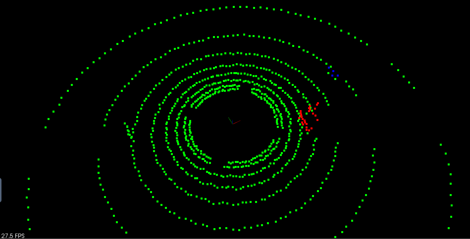
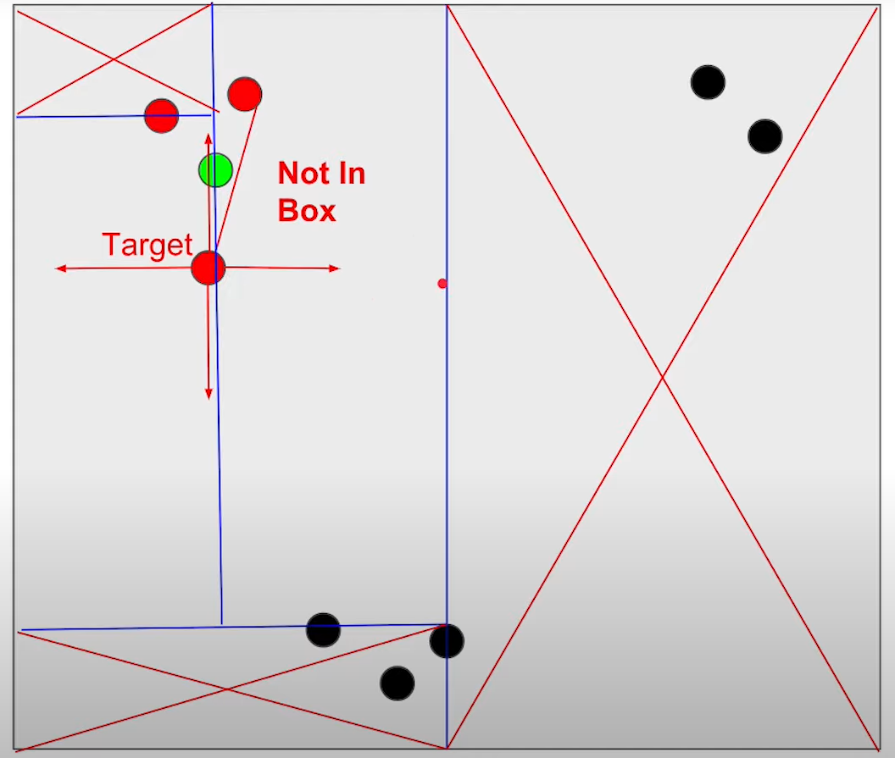
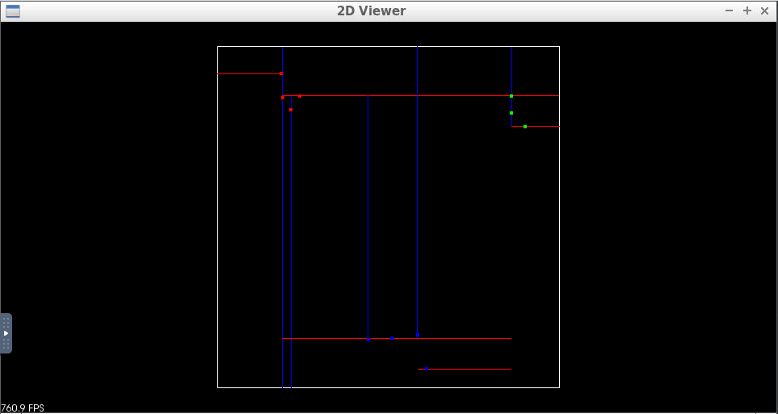
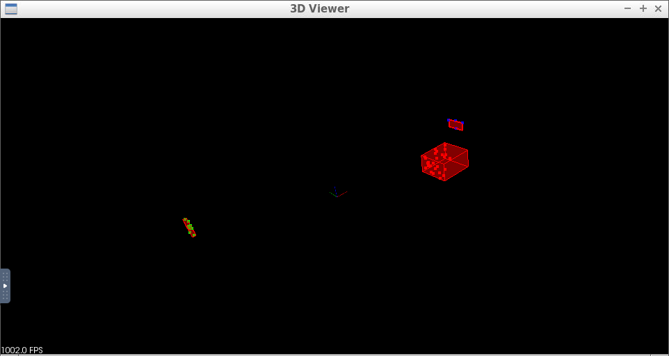

# Clustering Obstacles



## Implement Euclidean Clustering with PCL Library

```c++
template<typename PointT>
std::vector<typename pcl::PointCloud<PointT>::Ptr> ProcessPointClouds<PointT>::Clustering(typename pcl::PointCloud<PointT>::Ptr cloud, float clusterTolerance, int minSize, int maxSize)
{

    // Time clustering process
    auto startTime = std::chrono::steady_clock::now();

    std::vector<typename pcl::PointCloud<PointT>::Ptr> clusters;

    // TODO:: Fill in the function to perform euclidean clustering to group detected obstacles
    // Creating the KdTree object for the search method of the extraction
    typename pcl::search::KdTree<PointT>::Ptr tree (new pcl::search::KdTree<PointT>);
    tree->setInputCloud (cloud);

    std::vector<pcl::PointIndices> cluster_indices;
    typename pcl::EuclideanClusterExtraction<PointT> ec;
    ec.setClusterTolerance (clusterTolerance);
    ec.setMinClusterSize (minSize);
    ec.setMaxClusterSize (maxSize);
    ec.setSearchMethod (tree);
    ec.setInputCloud (cloud);
    ec.extract (cluster_indices);
  
    for (std::vector<pcl::PointIndices>::const_iterator it = cluster_indices.begin(); it != cluster_indices.end(); ++it)
    {
        pcl::PointCloud<pcl::PointXYZ>::Ptr cloud_cluster (new pcl::PointCloud<pcl::PointXYZ>);
        for (std::vector<int>::const_iterator pit = it->indices.begin (); pit != it->indices.end (); ++pit)
            cloud_cluster->points.push_back (cloud->points[*pit]); //*
        cloud_cluster->width = cloud_cluster->points.size();
        cloud_cluster->height = 1;
        cloud_cluster->is_dense = true;
      
        clusters.push_back(cloud_cluster);
    }

    auto endTime = std::chrono::steady_clock::now();
    auto elapsedTime = std::chrono::duration_cast<std::chrono::milliseconds>(endTime - startTime);
    std::cout << "clustering took " << elapsedTime.count() << " milliseconds and found " << clusters.size() << " clusters" << std::endl;

    return clusters;
}
```

## KD-Tree

A KD-Tree is a binary tree that splits points between alternating axes. By separating space by splitting regions, nearest neighbor search can be made much faster when using an algorithm like euclidean clustering.


## Inserting Points into KD-Tree in C++

```c++
// Structure to represent node of kd tree
struct Node
{
	std::vector<float> point;
	int id;
	Node* left;
	Node* right;

	Node(std::vector<float> arr, int setId)
	:	point(arr), id(setId), left(NULL), right(NULL)
	{}
};

struct KdTree
{
	Node* root;

	KdTree()
	: root(NULL)
	{}

	void insert(std::vector<float> point, int id)
	{
		// TODO: Fill in this function to insert a new point into the tree
		// the function should create a new node and place correctly with in the root 
		insertHelper(&root, 0, point, id);
	}
  
	void insertHelper(Node** node, uint depth, std::vector<float> point, int id)
    {
    	if (*node == NULL)
        	*node = new Node(point, id);
    	else if (point[depth%2] < (*node)->point[depth%2])
        	insertHelper(&((*node)->left), depth++, point, id);
        else
        	insertHelper(&((*node)->right), depth++, point, id);
    }
};
```

## Searching Points in a KD-Tree

Once points are able to be inserted into the tree, the next step is being able to search for nearby points inside the tree compared to a given target point. Points within a distance of `distanceTol` are considered to be nearby. The KD-Tree is able to split regions and allows certain regions to be completely ruled out, speeding up the process of finding nearby neighbors.



```c++
void searchHelper(std::vector<float> target, Node* node, uint depth, float distanceTol, std::vector<int> &ids)
{
    if (node != NULL)
    {
        if (node->point[0] >= target[0]-distanceTol && node->point[0] <= target[0]+distanceTol &&
            node->point[1] >= target[1]-distanceTol && node->point[1] <= target[1]+distanceTol)
        {
            float distance = sqrt((node->point[0]-target[0])*(node->point[0]-target[0]) + (node->point[1]-target[1])*(node->point[1]-target[1]));
            if (distance <= distanceTol)
                ids.push_back(node->id);
        }

        if (target[depth%2]-distanceTol < node->point[depth%2])
            searchHelper(target, node->left, depth++, distanceTol, ids);
        if (target[depth%2]+distanceTol > node->point[depth%2])
            searchHelper(target, node->right, depth++, distanceTol, ids);
    }
}

// return a list of point ids in the tree that are within distance of target
std::vector<int> search(std::vector<float> target, float distanceTol)
{
    std::vector<int> ids;
    searchHelper(target, root, 0, distanceTol, ids);

    return ids;
}
```


## Euclidean Clustering

To perform the clustering, iterate through each point in the cloud and keep track of which points have been processed already. For each point add it to a list of points defined as a cluster, then get a list of all the points in close proximity to that point by using the `search` function from the previous exercise. For each point in close proximity that hasn't already been processed, add it to the cluster and repeat the process of calling proximity points. Once the recursion stops for the first cluster, create a new cluster and move through the point list, repeating the above process for the new cluster. Once all the points have been processed, there will be a certain number of clusters found, return as a list of clusters.

## Pseudocode

```python
Proximity(point,cluster):
    mark point as processed
    add point to cluster
    nearby points = tree(point)
    Iterate through each nearby point
        If point has not been processed
            Proximity(cluster)

EuclideanCluster():
    list of clusters 
    Iterate through each point
        If point has not been processed
            Create cluster
            Proximity(point, cluster)
            cluster add clusters
    return clusters
```

## Quiz: Implemenet 2D Euclidean Clustering

 ```c++
void proximity(KdTree* tree, const std::vector<std::vector<float>>& points, std::vector<int>& cluster, std::vector<bool>& processed, int index, float distanceTol)
{
	processed[index] = true;
	cluster.push_back(index);
	std::vector<int> nearbyPoints = tree->search(points[index], distanceTol);
	for (int id : nearbyPoints)
    {
    	if (!processed[id])
        	proximity(tree, points, cluster, processed, id, distanceTol);
    }
}

std::vector<std::vector<int>> euclideanCluster(const std::vector<std::vector<float>>& points, KdTree* tree, float distanceTol)
{
	// TODO: Fill out this function to return list of indices for each cluster
	std::vector<std::vector<int>> clusters;
	std::vector<bool> processed(points.size(), false);
	for (int i = 0; i < points.size(); i++)
    {
    	if (!processed[i])
        {
        	std::vector<int> cluster;
        	proximity(tree, points, cluster, processed, i, distanceTol);
        	clusters.push_back(cluster);
        }
    }
	return clusters;
}
 ```

**Output:**



### 3D Bounding Box



# Extra Challenge: PCA Boxes

Some comments from the previous concept about the way bounding boxes are calculated. That method of generating bounding boxes the boxes are always oriented along the X and Y axis. This is ok if the cluster that you are looking at has its majority of points orientated along these axes , but what if the cluster was a very long rectangular object at a 45 degree angle to the X axis. The resulting bounding box would be a unnecessarily large, and would constrain your car's available space to move around. See the image below for reference.


In the above image, the bounding box on the right is more efficient, containing all the points with the minimum area required. It would be nice to take into account box rotation in the XY plane, about the Z axis. Rotation about the X or Y axes would yield weird results, since the car in the majority of situations is not concerned with the Z dimension, or has any control over Z movement.