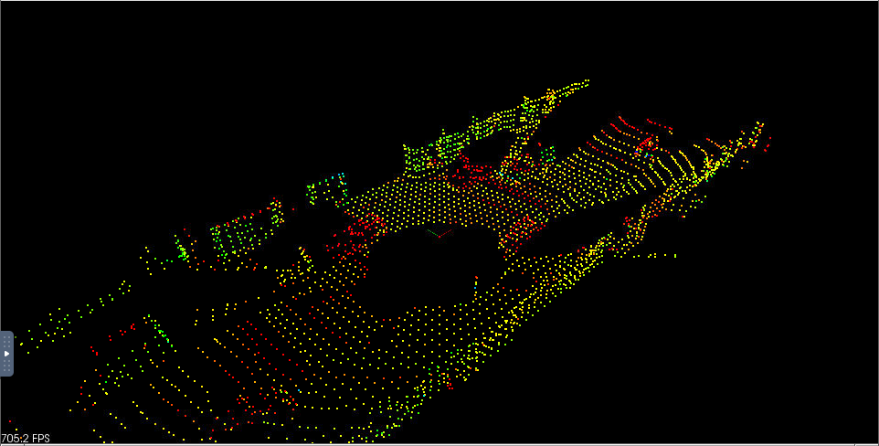
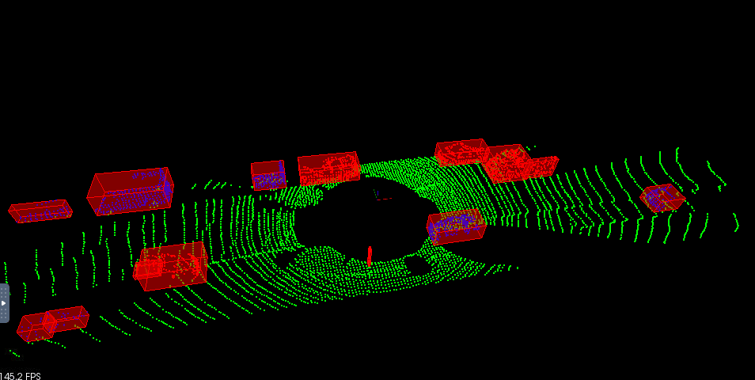

# Filter Real Point Clouds



## Voxel Grid

Voxel grid filtering will create a cubic grid and will filter the cloud by only leaving a single point per voxel cube, so the larger the cube length the lower the resolution of the point cloud.

## Region of Interest

A boxed region is defined and any points outside that box are removed.

To apply these methods you will fill in the point process function `FilterCloud`. The arguments to this function will be your input cloud, voxel grid size, and min/max points representing your region of interest. The function will return the downsampled cloud with only points that were inside the region specified. To get started check out the documentation from PCL for [voxel grid filtering](http://pointclouds.org/documentation/tutorials/voxel_grid.php) and [region of interest](http://docs.pointclouds.org/trunk/classpcl_1_1_crop_box.html).

## Filter Point Clouds with PCL

```c++
template<typename PointT>
typename pcl::PointCloud<PointT>::Ptr ProcessPointClouds<PointT>::FilterCloud(typename pcl::PointCloud<PointT>::Ptr cloud, float filterRes, Eigen::Vector4f minPoint, Eigen::Vector4f maxPoint)
{

    // Time segmentation process
    auto startTime = std::chrono::steady_clock::now();

    // TODO:: Fill in the function to do voxel grid point reduction and region based filtering
    // Create the filtering object
    typename pcl::VoxelGrid<PointT> vg;
    typename pcl::PointCloud<PointT>::Ptr cloudFiltered (new pcl::PointCloud<PointT>);
    vg.setInputCloud (cloud);
    vg.setLeafSize (filterRes, filterRes, filterRes);
    vg.filter (*cloudFiltered);
  
    typename pcl::PointCloud<PointT>::Ptr cloudRegion (new pcl::PointCloud<PointT>);
    typename pcl::CropBox<PointT> region(true);
    region.setMin(minPoint);
    region.setMax(maxPoint);
    region.setInputCloud(cloudFiltered);
    region.filter(*cloudRegion);
  
    std::vector<int> indices;
  
    typename pcl::CropBox<PointT> roof(true);
    roof.setMin(Eigen::Vector4f (-1.5, -1.7, -1, 1));
    roof.setMax(Eigen::Vector4f (2.6, 1.7, -0.4, 1));
    roof.setInputCloud(cloudRegion);
    roof.filter(indices);
  
    pcl::PointIndices::Ptr inliers {new pcl::PointIndices};
    for (int point : indices)
        inliers->indices.push_back(point);
  
    pcl::ExtractIndices<PointT> extract;
    extract.setInputCloud(cloudRegion);
    extract.setIndices(inliers);
    extract.setNegative(true);
    extract.filter(*cloudRegion);

    auto endTime = std::chrono::steady_clock::now();
    auto elapsedTime = std::chrono::duration_cast<std::chrono::milliseconds>(endTime - startTime);
    std::cout << "filtering took " << elapsedTime.count() << " milliseconds" << std::endl;

    return cloudRegion;
}
```


## Final Stream Result

