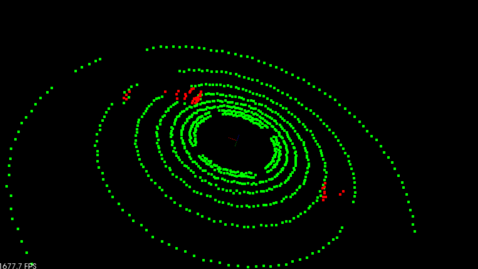
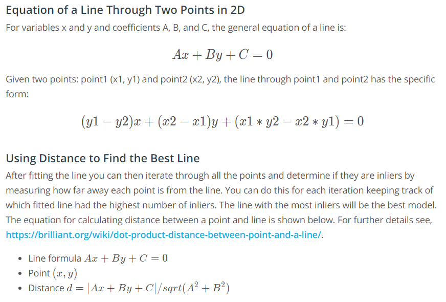
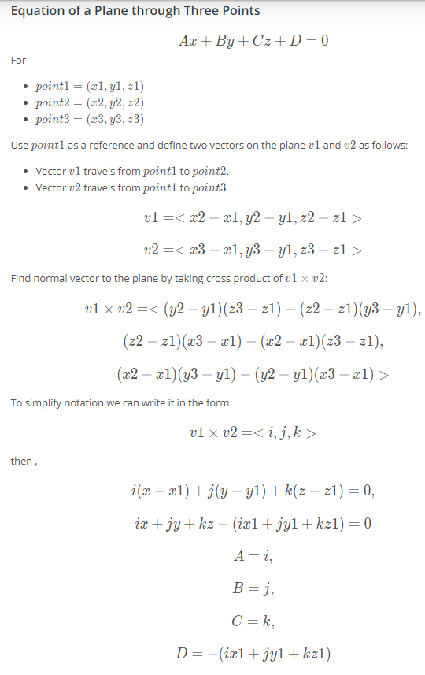
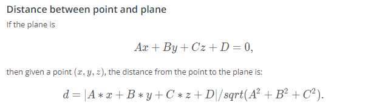

# Segmentation

## Plane Segmentation



## Plane Segmentation with PCL

```c++
template<typename PointT>
std::pair<typename pcl::PointCloud<PointT>::Ptr, typename pcl::PointCloud<PointT>::Ptr> ProcessPointClouds<PointT>::SegmentPlane(typename pcl::PointCloud<PointT>::Ptr cloud, int maxIterations, float distanceThreshold)
{
    // Time segmentation process
    auto startTime = std::chrono::steady_clock::now();
    // Fill in this function to find inliers for the cloud.
    pcl::ModelCoefficients::Ptr coefficients (new pcl::ModelCoefficients);
    pcl::PointIndices::Ptr inliers (new pcl::PointIndices);
    // Create the segmentation object
    pcl::SACSegmentation<PointT> seg;
    // Optional
    seg.setOptimizeCoefficients (true);
    // Mandatory
    seg.setModelType (pcl::SACMODEL_PLANE);
    seg.setMethodType (pcl::SAC_RANSAC);
    seg.setDistanceThreshold (distanceThreshold);
  	seg.setMaxIterations(maxIterations);

    seg.setInputCloud (cloud);
    seg.segment (*inliers, *coefficients);

    if (inliers->indices.size () == 0)
    {
      std::cout << "Could not estimate a planar model for the given dataset." << std::endl;
    }

    auto endTime = std::chrono::steady_clock::now();
    auto elapsedTime = std::chrono::duration_cast<std::chrono::milliseconds>(endTime - startTime);
    std::cout << "plane segmentation took " << elapsedTime.count() << " milliseconds" << std::endl;

    std::pair<typename pcl::PointCloud<PointT>::Ptr, typename pcl::PointCloud<PointT>::Ptr> segResult = SeparateClouds(inliers,cloud);
    return segResult;
}
```

## Separating Point Clouds

```c++
template<typename PointT>
std::pair<typename pcl::PointCloud<PointT>::Ptr, typename pcl::PointCloud<PointT>::Ptr> ProcessPointClouds<PointT>::SeparateClouds(pcl::PointIndices::Ptr inliers, typename pcl::PointCloud<PointT>::Ptr cloud) 
{
  	// Create two new point clouds, one cloud with obstacles and other with segmented plane
  
  	typename pcl::PointCloud<PointT>::Ptr obstacleCloud (new pcl::PointCloud<PointT>());
    typename pcl::PointCloud<PointT>::Ptr planeCloud (new pcl::PointCloud<PointT>());
  	// Extract the planar inliers from the input cloud
    pcl::ExtractIndices<PointT> extract;
    extract.setInputCloud (cloud);
    extract.setIndices (inliers);
    extract.setNegative (false);

    // Get the points associated with the planar surface
    extract.filter (*planeCloud);

    // Remove the planar inliers, extract obstacles
    extract.setNegative (true);
    extract.filter (*obstacleCloud);

    std::pair<typename pcl::PointCloud<PointT>::Ptr, typename pcl::PointCloud<PointT>::Ptr> segResult(obstacleCloud, planeCloud);
    return segResult;
}
```

## RANSAC for Lines





## RANSAC for Planes





## Implement RANSAC for Planes in C++

```c++
std::unordered_set<int> Ransac(pcl::PointCloud<pcl::PointXYZ>::Ptr cloud, int maxIterations, float distanceTol)
{
    auto startTime = std::chrono::steady_clock::now();
  
	std::unordered_set<int> inliersResult;
	srand(time(NULL));
  
	// For max iterations 
    unsigned int size = cloud->points.size();
    for (unsigned int i = 0; i < maxIterations; i++) {
        // Randomly sample subset and fit line
    	std::unordered_set<int> inliers;
    	while (inliers.size() < 3) {
        	inliers.insert(rand()%size);
        }
    	
    	float x1, y1, z1, x2, y2, z2, x3, y3, z3;
      
    	auto itr = inliers.begin();
    	x1 = cloud->points[*itr].x;
    	y1 = cloud->points[*itr].y;
    	z1 = cloud->points[*itr].z;
    	itr++;
    	x2 = cloud->points[*itr].x;
    	y2 = cloud->points[*itr].y;
    	z2 = cloud->points[*itr].z;
    	itr++;
    	x3 = cloud->points[*itr].x;
    	y3 = cloud->points[*itr].y;
    	z3 = cloud->points[*itr].z;
    
    	float A = (y2-y1)*(z3-z1) - (z2-z1)*(y3-y1);
    	float B = (z2-z1)*(x3-x1) - (x2-x1)*(z3-z1);
    	float C = (x2-x1)*(y3-y1) - (y2-y1)*(x3-x1);
    	float D = - (A*x1 + B*y1 + C*z1);
      
        for (int j = 0; j < size; j++) {
          
        	if (inliers.count(j) > 0)
            	continue;
          
        	auto p = cloud->points[j];
            float x = p.x;
        	float y = p.y;
        	float z = p.z;
          	// Measure distance between every point and fitted plane
			// If distance is smaller than threshold count it as inlier
        	float dist = fabs(A*x + B*y + C*z + D) / sqrt(A*A + B*B + C*C);
        	if (dist <= distanceTol)
            	inliers.insert(j);
        }
    	if (inliers.size() > inliersResult.size()) {
        	inliersResult = inliers;
        }
    }
  
  	auto endTime = std::chrono::steady_clock::now();
    auto elapsedTime = std::chrono::duration_cast<std::chrono::milliseconds>(endTime - startTime);
    std::cout << "line Ransac took " << elapsedTime.count() << " milliseconds" << std::endl;

	// Return indicies of inliers from fitted line with most inliers
	return inliersResult;
}
```

