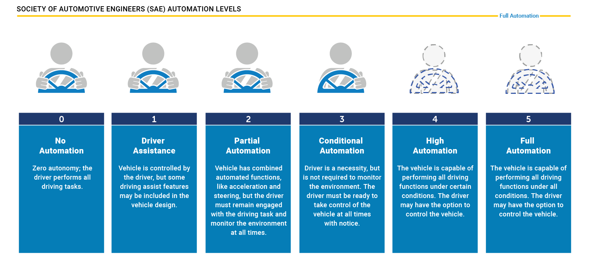
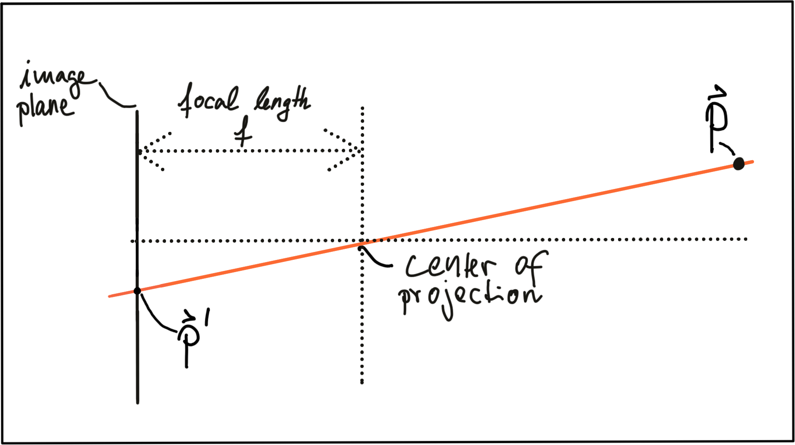
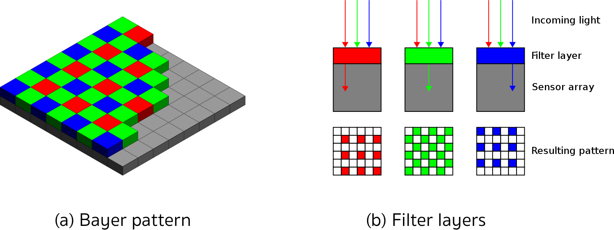

# Autonomous Vehicle and Computer Vision

## Levels of Autonomous Driving

## Sensor Selection Criteria

The design of an autonomous or ADAS-equipped vehicle involves the selection of a suitable sensor set. As you have learned in the preceding section, there is a discussion going on about which combination of sensors would be necessary to reach full (or even partial) autonomy. In this section, you will learn about sensor selection criteria as well as the differences between camera, Lidar and radar with respect to each criterion.

In the following, the most typical selection criteria are briefly discussed.

1. **Range** : Lidar and radar systems can detect objects at distances ranging from a few meters to more than 200m. Many Lidar systems have difficulties detecting objects at very close distances, whereas radar can detect objects from less than a meter, depending on the system type (either long, mid or short range) . Mono cameras are not able to reliably measure metric distance to object - this is only possible by making some assumptions about the nature of the world (e.g. planar road surface). Stereo cameras on the other hand can measure distance, but only up to a distance of approx. 80m with accuracy deteriorating significantly from there.
2. **Spatial resolution** : Lidar scans have a spatial resolution in the order of 0.1° due to the short wavelength of the emitted IR laser light . This allows for high-resolution 3D scans and thus characterization of objects in a scene. Radar on the other hand can not resolve small features very well, especially as distances increase. The spatial resolution of camera systems is defined by the optics, by the pixel size on the image and by its signal-to-noise ratio. Details on small object are lost as soon as the light rays emanating from them are spread to several pixels on the image sensor (blurring). Also, when little ambient light exists to illuminate objects, spatial resolution increases as objects details are superimposed by increasing noise levels of the imager.
3. **Robustness in darkness** : Both radar and Lidar have an excellent robustness in darkness, as they are both active sensors. While daytime performance of Lidar systems is very good, they have an even better performance at night because there is no ambient sunlight that might interfere with the detection of IR laser reflections. Cameras on the other hand have a very reduced detection capability at night, as they are passive sensors that rely on ambient light. Even though there have been advances in night time performance of image sensors, they have the lowest performance among the three sensor types.
4. **Robustness in rain, snow, fog** : One of the biggest benefits of radar sensors is their performance under adverse weather conditions. They are not significantly affected by snow, heavy rain or any other obstruction in the air such as fog or sand particles. As an optical system, Lidar and camera are susceptible to adverse weather and its performance usually degrades significantly with increasing levels of adversity.
5. **Classification of objects** : Cameras excel at classifying objects such as vehicles, pedestrians, speed signs and many others. This is one of the prime advantage of camera systems and recent advances in AI emphasize this even stronger. Lidar scans with their high-density 3D point clouds also allow for a certain level of classification, albeit with less object diversity than cameras. Radar systems do not allow for much object classification.
6. **Perceiving 2D structures** : Camera systems are the only sensor able to interpret two-dimensional information such as speed signs, lane markings or traffic lights, as they are able to measure both color and light intensity. This is the primary advantage of cameras over the other sensor types.
7. **Measure speed** : Radar can directly measure the velocity of objects by exploiting the Doppler frequency shift. This is one of the primary advantages of radar sensors. Lidar can only approximate speed by using successive distance measurements, which makes it less accurate in this regard. Cameras, even though they are not able to measure distance, can measure time to collision by observing the displacement of objects on the image plane. This property will be used later in this course.
8. **System cost** : Radar systems have been widely used in the automotive industry in recent years with current systems being highly compact and affordable. The same holds for mono cameras, which have a price well below US$100 in most cases. Stereo cameras are more expensive due to the increased hardware cost and the significantly lower number of units in the market. Lidar has gained popularity over the last years, especially in the automotive industry. Due to technological advances, its cost has dropped from more than US$75,000 to below US$5,000. Many experts predict that the cost of a Lidar module might drop to less than US$500 over the next years.
9. **Package size** : Both radar and mono cameras can be integrated very well into vehicles. Stereo cameras are in some cases bulky, which makes it harder to integrate them behind the windshield as they sometimes may restrict the driver's field of vision. Lidar systems exist in various sizes. The 360° scanning Lidar is typically mounted on top of the roof and is thus very well visible. The industry shift towards much smaller solid-state Lidar systems will dramatically shrink the system size of Lidar sensors in the very near future.
10. **Computational requirements** : Lidar and radar require little back-end processing. While cameras are a cost-efficient and easily available sensor, they require significant processing to extract useful information from the images, which adds to the overall system cost.

In the following table, the different sensor types are assessed with regard to the criteria discussed above.

|            | Range measurement | Robustness in darkness | Robustness in rain, snow, or fog | Classification of objects | Perceiving 2D Structures | Measure speed / TTC | Package size |
| :--------: | :---------------: | :--------------------: | :------------------------------: | :-----------------------: | :----------------------: | :-----------------: | :----------: |
| **Camera** |         -         |           -            |                -                 |            ++             |            ++            |          +          |      +       |
| **Radar**  |        ++         |           ++           |                ++                |             -             |            -             |         ++          |      +       |
| **Lidar**  |         +         |           ++           |                +                 |             +             |            -             |          +          |      -       |

## Camera Technology Overview

### The Pinhole camera

In three-dimensional space, the relation between P*P* and P'*P*′ is expressed by the following equations:

The problem with pinhole cameras is that the amount of light passing through the pinhole is not sufficient to generate a decent image on an image sensor. If one were to increase the amount of light by widening the pinhole opening as shown in the figure below, rays of light from other parts of the object of interest would superimpose each other, leading to a blurring effect: The larger the pinhole, the brighter the image but at the same time, the more severe the blurring of the object on the image plane would be.

One way to solve this problem is use a lens, which is able to capture multiple rays of light that emanate from the same point on the object of interest. So let’s look at lenses next.

## Lenses and Aperture

A properly sized and positioned lens refracts all rays of light that emanate from a point P1 on an object in space such that they converge to a single point p_1'*p*1′ in the image plane. To reduce blurring, an aperture can be used, which is a concentric opening of usually adjustable size placed directly behind the lens. The following figure illustrates the principle:

By reducing the diameter of the aperture, light rays passing through the lens on the outer edges are blocked, which reduces the size of the COF on the image plane. It can easily be seen that a smaller aperture results in reduced blurring, but at the expense of low light sensitivity. The larger the aperture, the more light rays are focussed onto the image area, resulting in brighter images with a better signal-to-noise ratio.

 In practice, lenses introduce distortion into images, depending on the lens type. The distortion most relevant to practice is called “radial distortion”. It is caused by the focal length of the lens not being uniform over its diameter. Therefore, the magnification effect of the lens changes depending on the distance between the camera center (the optical axis) and the ray of light passing through the lens. If the magnification increases the resulting distortion effect is called ‚pin cushion distortion‘. It it decreases, it is called ‚barrel distortion‘ instead. Barrel distortions usually occur, when wide-angle lenses are used. In the figure below, both distortion types are illustrated.

The first step after projecting a point P*P* in space onto the image plane is thus to subtract the principal point coordinates so that the discrete image has its own coordinate system centered in e.g. the lower left corner of the image plane

The second step in the transformation process is to move from metric to pixel coordinates. To do so, we can use parameters k*k* and l*l* provided by the calibration procedure which convert meters to pixels and which can be easily integrated into the projection equations as seen below. Note that in image coordinates, the y-axis has its origin in the upper-left corner and is pointing downwards.

**Notes**

One final note on image rectification: In many applications (e.g. feature tracking) it makes sense to process the original image to avoid interpolation errors when the rectified image is computed and transformed pixels do not fall exactly onto the center of a discrete pixel in the rectified image but close to the border to another pixel instead. In such a case, it is advisable to locate the features in the unmodified original image and then transform the resulting coordinates using the equations above. When using deep learning based on a set of trained weights, it makes sense to rectify the image first before feeding it to a network - if we would use the original image, distortions (such as from a fish-eye lens) would lead to detection errors as networks are usually trained on a distortion-free image set.

### Imagers and Bayer Pattern

In this last section, you will learn how rays of light with a certain wavelength are converted into color pixels that can be stored digitally.

When an image is captured by a camera, light passes through the lens and falls on the image sensor. This sensor consists of light sensitive elements that register the amount of light that falls on them and convert it into a corresponding number of electrons. The more light, the more electrons are generated. Once the exposure time is complete, the generated electrons are converted into a voltage, which is finally transformed into a discrete number by means of an A/D-converter.

Currently, there are two main image technologies, which are **CCD (Charge-Coupled Device)** and **CMOS (Complementary Metal-oxide Semiconductor)**. Both technologies convert electrons into voltage and are inherently color blind, as they can not distinguish the different wavelengths which generate the electrons. To enable color vision, tiny filter elements (also micro-lenses) are placed in front of each pixel which only allow a certain wavelength to pass through. One common way to map wavelength to color is to arrange the filter elements in an RGB (Red, Green, Blue) pattern to allow the primary colors to pass through individually, which gives us three individual images - one for each primary color.

### CCD vs. CMOS

In a *CCD sensor*, the electrons collected in each picture element are transferred from the chip through a single or only a few output nodes. The charges are then converted to voltage levels, buffered, and sent out as an analog signal. This signal is then amplified and converted to discrete numbers using an A/D-converter outside the sensor. Originally, CCD technology has had several advantages compared to CMOS, such as higher light sensitivity and less noise. In recent years, however, these differences have all but disappeared. The major disadvantages of CCD are a higher production price and a higher power consumption (up to 100x more than CMOS) , which usually leads to heat issues in the camera.

CMOS *sensors* were originally used for machine vision applications, but the image quality was poor due to their inferior light sensitivity. With modern CMOS sensors however, both quality and light sensitivity have significantly increased. The CMOS technology has several advantages: Unlike CCD, CMOS chips incorporate amplifiers and A/D-converters, which brings a huge cost advantage. With CCD, those components are located outside of the chip. CMOS sensors also have a faster data readout, lower power consumption, higher noise immunity, and a smaller system size. In automotive applications, almost all cameras use CMOS sensors because of these advantages. The camera setup used for recording most of the image sequences in this course can be found here : http://www.cvlibs.net/datasets/kitti/setup.php

