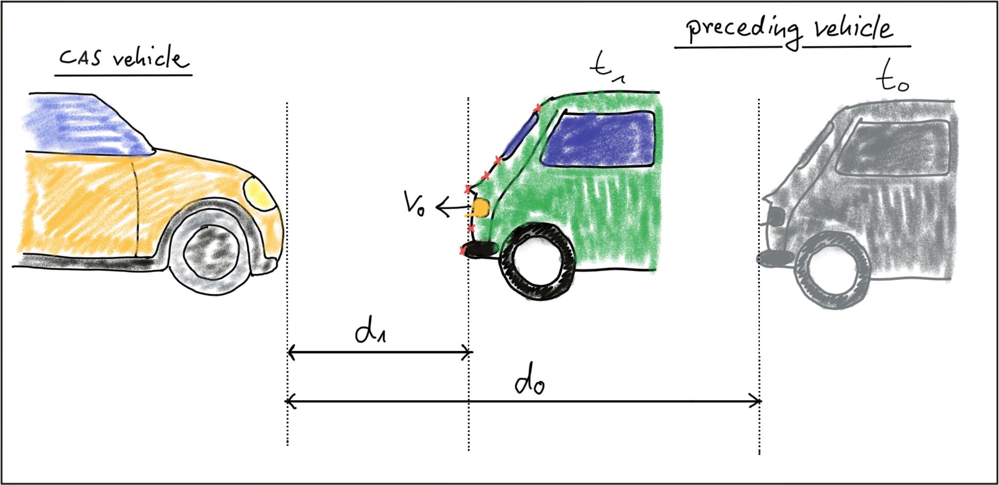

# Collision Detection System

## Collision Detection Basics

## Constant velocity vs. constant acceleration

To compute the TTC, we need to make assumptions on the physical behavior of the preceding vehicle. One assumption could be that the relative velocity between the yellow and green vehicle in the above figure were constant. This would lead to the so-called *constant velocity model* (CVM) which is represented by eq. 1 in the following diagram.

## Exercise

Imagine the following scenario: A preceding vehicle with a relative distance of 25m and a relative speed to the CAS-equipped vehicle of 30km/h is braking hard. The road surface is slippery and the resulting constant deceleration is at 5m/s^2.

### Solution

