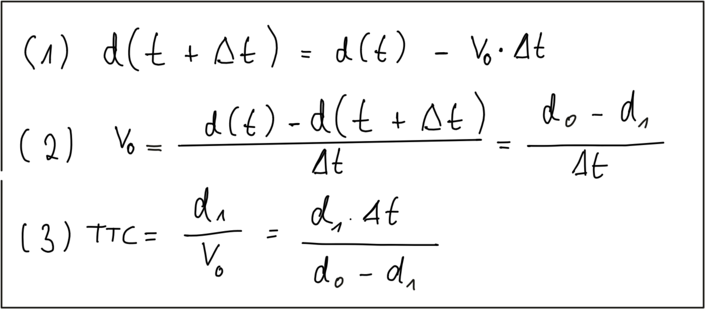
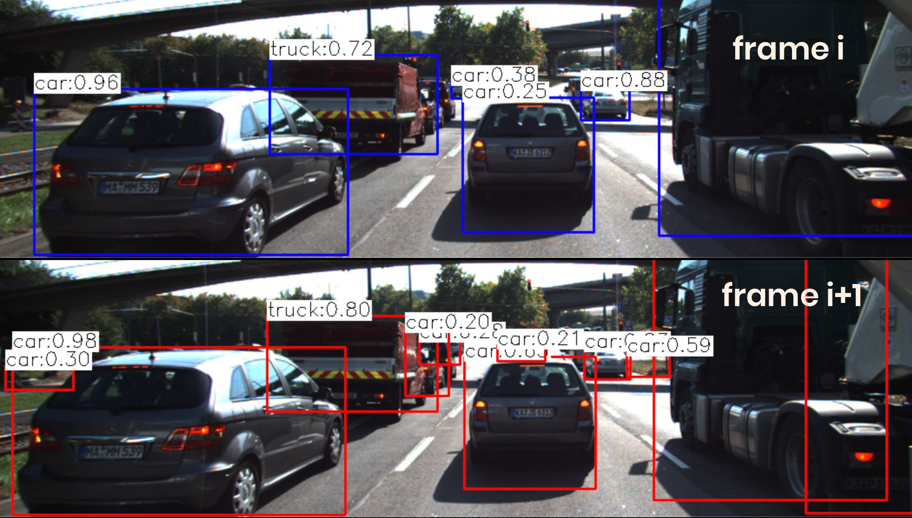

# Collision Detection System

## Collision Detection Basics


## Constant velocity vs. constant acceleration

To compute the TTC, we need to make assumptions on the physical behavior of the preceding vehicle. One assumption could be that the relative velocity between the yellow and green vehicle in the above figure were constant. This would lead to the so-called *constant velocity model* (CVM) which is represented by eq. 1 in the following diagram.


## Exercise

Imagine the following scenario: A preceding vehicle with a relative distance of 25m and a relative speed to the CAS-equipped vehicle of 30km/h is braking hard. The road surface is slippery and the resulting constant deceleration is at 5m/s^2.

### Solution


## Estimating TTC with Lidar



```c++
void computeTTCLidar(std::vector<LidarPoint> &lidarPointsPrev,
                     std::vector<LidarPoint> &lidarPointsCurr, double &TTC)
{
    // auxiliary variables
    double dT = 0.1;        // time between two measurements in seconds
    double laneWidth = 4.0; // assumed width of the ego lane

    // find closest distance to Lidar points within ego lane
    double minXPrev = 1e9, minXCurr = 1e9;
    for (auto it = lidarPointsPrev.begin(); it != lidarPointsPrev.end(); ++it)
    {
        
        if (abs(it->y) <= laneWidth / 2.0)
        { // 3D point within ego lane?
            minXPrev = minXPrev > it->x ? it->x : minXPrev;
        }
    }

    for (auto it = lidarPointsCurr.begin(); it != lidarPointsCurr.end(); ++it)
    {

        if (abs(it->y) <= laneWidth / 2.0)
        { // 3D point within ego lane?
            minXCurr = minXCurr > it->x ? it->x : minXCurr;
        }
    }

    // compute TTC from both measurements
    TTC = minXCurr * dT / (minXPrev - minXCurr);
}
```


## Estimating TTC with a Camera (without distance)


**Equations:**


In (1) we use the focal length of the camera and a distance measurement d_0*d*0 performed at time t_0*t*0 to project the height H*H* of the vehicle onto the image plane and thus to a height h_0*h*0 in pixels. The same is done at time t_1*t*1, leading to a projected height h_1*h*1.

In (2), we compute the ratio of the relative heights h_0*h*0 and h_1*h*1. As both H*H* and f*f* are cancelled out, we can observe a direct relation between relative height h*h* and absolute metric distance d*d*. We can thus express the distance to the vehicle d_0*d*0 as the product of d_1*d*1 and the ratio of relative heights on the image plane.

In (3), we substitute d_0*d*0 in the equation for constant velocity and solve for d_1*d*1, which is now dependent on the constant relative velocity v_0*v*0, on the time between measuring d_0*d*0 and d_1*d*1 and on the ratio of relative heights on the image plane.

In (4), the TTC is computed as the ratio of remaining distance to impact, which is d_1*d*1, and the constant velocity v_0*v*0. As we can easily see, the TTC now only consists of \Delta tΔ*t*, h_0*h*0 and h_1*h*1. Thus, it is possible to measure the time to collision by observing relative height change on the image sensor. Distance measurements are not needed and we can thus use a mono camera to estimate the time-to-collision by observing changes in relative height (also called *scale change*) directly in the image.

## The Problem with Bounding Box Detection



In most engineering tasks, relying on a single measurement or property is not reliable enough. This holds especially true for safety-related products. Therefore, we want to consider wether there are further properties of vehicles and objects we can observe in an image.

## Using Texture Keypoints Instead

Instead of relying on the detection of the vehicle as a whole we now want to analyze its structure on a smaller scale. If if were possible to locate uniquely identifiable keypoints that could be tracked from one frame to the next, we could use the distance between all keypoints on the vehicle relative to each other to compute a robust estimate of the height ratio in out TTC equation. The following figure illustrates the concept.


## Computing TTC from Relative Keypoint Distances

In the code examples in this course, matching keypoints between images are packaged into an OpenCV data structure called `cv::DMatch`. The structure elements we will be using in this course are `queryIdx`, which is the index of a keypoint in the current frame, and `trainIdx`, which is the index of the matched keypoint in the previous frame.

All matched keypoints are stored in a dynamic list, which is then passed to a function called `computeTTCCamera`, which returns the time-to-collision for each object in the scene. Let us take a look at this function in the following.


## Exercise

```c++
// Compute time-to-collision (TTC) based on keypoint correspondences in successive images
void computeTTCCamera(std::vector<cv::KeyPoint> &kptsPrev, std::vector<cv::KeyPoint> &kptsCurr,
                      std::vector<cv::DMatch> kptMatches, double frameRate, double &TTC)
{
    // compute distance ratios between all matched keypoints
    vector<double> distRatios; // stores the distance ratios for all keypoints between curr. and prev. frame
    for (auto it1 = kptMatches.begin(); it1 != kptMatches.end() - 1; ++it1)
    { // outer kpt. loop

        // get current keypoint and its matched partner in the prev. frame
        cv::KeyPoint kpOuterCurr = kptsCurr.at(it1->trainIdx);
        cv::KeyPoint kpOuterPrev = kptsPrev.at(it1->queryIdx);

        for (auto it2 = kptMatches.begin() + 1; it2 != kptMatches.end(); ++it2)
        { // inner kpt.-loop

            double minDist = 100.0; // min. required distance

            // get next keypoint and its matched partner in the prev. frame
            cv::KeyPoint kpInnerCurr = kptsCurr.at(it2->trainIdx);
            cv::KeyPoint kpInnerPrev = kptsPrev.at(it2->queryIdx);

            // compute distances and distance ratios
            double distCurr = cv::norm(kpOuterCurr.pt - kpInnerCurr.pt);
            double distPrev = cv::norm(kpOuterPrev.pt - kpInnerPrev.pt);

            if (distPrev > std::numeric_limits<double>::epsilon() && distCurr >= minDist)
            { // avoid division by zero

                double distRatio = distCurr / distPrev;
                distRatios.push_back(distRatio);
            }
        } // eof inner loop over all matched kpts
    }     // eof outer loop over all matched kpts

    // only continue if list of distance ratios is not empty
    if (distRatios.size() == 0)
    {
        TTC = NAN;
        return;
    }

    // compute camera-based TTC from distance ratios
    // double meanDistRatio = std::accumulate(distRatios.begin(), distRatios.end(), 0.0) / distRatios.size();
    // double dT = 1 / frameRate;
    // TTC = -dT / (1 - meanDistRatio);

    // STUDENT TASK (replacement for meanDistRatio)
    std::sort(distRatios.begin(), distRatios.end());
    long medIndex = floor(distRatios.size() / 2.0);
    double medDistRatio = distRatios.size() % 2 == 0 ? (distRatios[medIndex - 1] + distRatios[medIndex]) / 2.0 : distRatios[medIndex]; // compute median dist. ratio to remove outlier influence
    double dT = 1 / frameRate;
    TTC = -dT / (1 - medDistRatio);
}
```

