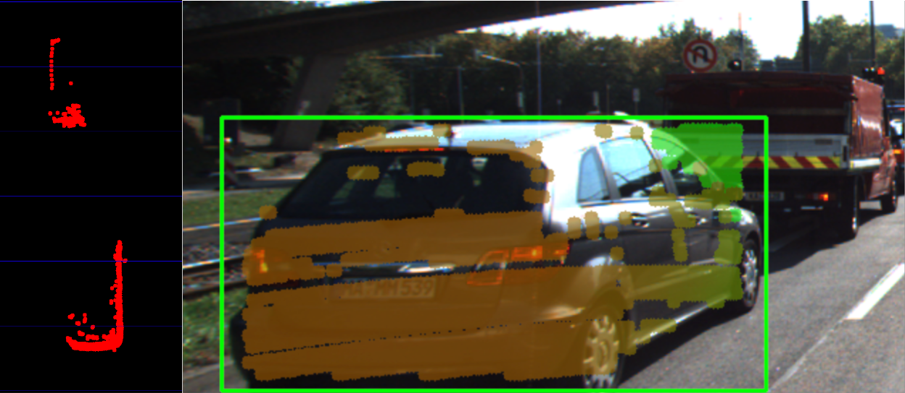

#  Lidar-to-Camera Point Projection

## Homogeneous coordinates

In addition to the intrinsic camera parameters which make up the geometry of the projection, we need additional information about the position and alignment of both camera and Lidar in a common reference coordinate system. To move from Lidar to camera involves translation and rotation operations, which we need to apply to every 3D point. So our goal here is to simplify the notation with which we can express the projection. Using a linear transformation (or mapping), 3D points could be represented by a vector and operations such as translation, rotation, scaling and perspective projection could be represented as matrices by which the vector is multiplied. The problem with the projection equations we have so far is that they involve a division by Z, which makes them non-linear and thus prevents us from transforming them into the much more convenient matrix-vector form.

A way to avoid this problem is to change the coordinate system and go from the original Euclidean coordinate system to a form called the *Homogenous coordinate system*. Moving back and forth between both coordinate systems is a non-linear operation, but once we are in the homogenous coordinate system, projective transformations such as the one given above become linear and can thus be expressed as simple matrix-vector multiplications. Transformations between both coordinate systems work as shown in the following figure.


A point in the n-dimensional euclidian coordinate system is represented by a vector with n components. The transformation into (n+1)-dimensional homogeneous coordinates can be achieved by simply adding the number 1 as an additional component. The transformation can be applied to both image coordinates as well as scene coordinates.

Converting back from homogeneous coordinates to Euclidean then works by suppressing the last coordinate and dividing the first n coordinates by the (n+1)-th coordinate as shown in the figure above. As discussed earlier in this section, this is a non-linear operation and once we are back in Euclidean space, the neat separation of the different parameters into individual matrix components is lost. In the following, we will take a look at those matrix components.


### Exercise

```c++
void projectLidarToCamera2()
{
    // load image from file
    cv::Mat img = cv::imread("../images/0000000000.png");

    // load Lidar points from file
    std::vector<LidarPoint> lidarPoints;
    readLidarPts("../dat/C51_LidarPts_0000.dat", lidarPoints);

    // store calibration data in OpenCV matrices
    cv::Mat P_rect_00(3,4,cv::DataType<double>::type); // 3x4 projection matrix after rectification
    cv::Mat R_rect_00(4,4,cv::DataType<double>::type); // 3x3 rectifying rotation to make image planes co-planar
    cv::Mat RT(4,4,cv::DataType<double>::type); // rotation matrix and translation vector
    loadCalibrationData(P_rect_00, R_rect_00, RT);
    
    // TODO: project lidar points
    cv::Mat visImg = img.clone();
    cv::Mat overlay = visImg.clone();

    cv::Mat X(4,1,cv::DataType<double>::type);
    cv::Mat Y(3,1,cv::DataType<double>::type);
    for(auto it=lidarPoints.begin(); it!=lidarPoints.end(); ++it) {
        float maxX = 25.0, maxY = 6.0, minZ = -1.4; 
        if(it->x > maxX || it->x < 0.0 || abs(it->y) > maxY || it->z < minZ || it->r<0.01 )
        {
            continue; // skip to next point
        }
      
        // 1. Convert current Lidar point into homogeneous coordinates and store it in the 4D variable X.
        X.at<double>(0,0) = it->x;
        X.at<double>(1,0) = it->y;
        X.at<double>(2,0) = it->z;
        X.at<double>(3,0) = 1.0;

        // 2. Then, apply the projection equation as detailed in lesson 5.1 to map X onto the image plane of the camera. 
        // Store the result in Y.
        Y = P_rect_00 * R_rect_00 * RT * X;

        // 3. Once this is done, transform Y back into Euclidean coordinates and store the result in the variable pt.
        cv::Point pt;
        pt.x = Y.at<double>(0,0)/Y.at<double>(2,0);
        pt.y = Y.at<double>(1,0)/Y.at<double>(2,0);

        float val = it->x;
        float maxVal = 20.0;
        int red = min(255, (int)(255 * abs((val - maxVal) / maxVal)));
        int green = min(255, (int)(255 * (1 - abs((val - maxVal) / maxVal))));
        cv::circle(overlay, pt, 5, cv::Scalar(0, green, red), -1);
    }

    float opacity = 0.6;
    cv::addWeighted(overlay, opacity, visImg, 1 - opacity, 0, visImg);
    
    string windowName = "LiDAR data on image overlay";
    cv::namedWindow( windowName, 3 );
    cv::imshow( windowName, visImg );
    cv::waitKey(0); // wait for key to be pressed
}
```

### Result


## Grouping Lidar Points Using a Region of Interest

In the following, we will make use of the ROI to associate 3D Lidar points in space with 2D objects in the camera image. As can be seen in the following image, the idea is to project all Lidar points onto the image plane using calibration data and camera view geometry. By cycling through all Lidar points contained in the current data buffer in an outer loop and through all ROI in an inner loop, a test can be performed to check whether a Lidar point belongs to a specific bounding box.


In some cases, object detection returns ROI that are too large and thus overlap into parts of the scene that are not a part of the enclosed object (e.g. a neighboring vehicle or the road surface). It is therefore advisable to adjust the size of the ROI slightly so that the number of Lidar points which are not physically located on the object is reduced. The following code shows how this can be achieved without much effort.

```c++
vector<vector<BoundingBox>::iterator> enclosingBoxes; // pointers to all bounding boxes which enclose the current Lidar point
for (vector<BoundingBox>::iterator it2 = boundingBoxes.begin(); it2 != boundingBoxes.end(); ++it2)
{
    // shrink current bounding box slightly to avoid having too many outlier points around the edges
    cv::Rect smallerBox;
    smallerBox.x = (*it2).roi.x + shrinkFactor * (*it2).roi.width / 2.0;
    smallerBox.y = (*it2).roi.y + shrinkFactor * (*it2).roi.height / 2.0;
    smallerBox.width = (*it2).roi.width * (1 - shrinkFactor);
    smallerBox.height = (*it2).roi.height * (1 - shrinkFactor);
```

By providing a factor "shrinkFactor" which denotes the amount of resizing in [% ], a smaller box is created from the original bounding box. Further down in the code (see final project student code for details), a check is performed for each keypoint wether it belongs to the smaller bounding box. The figure below shows two different settings for "shrinkFactor". It can be seen that for second figure, the projected Lidar points are concentrated on the central area of the preceding vehicle whereas Lidar points close to the edges are ignored.


In practice, a moderate setting of 5-10% should be used to avoid discarding too much data. In some cases, when the bounding boxes returned by object detection are severely oversized, this process of boundary frame shrinkage can be an important tool to improve the quality of the associated Lidar point group.

## Exercise: Avoiding Grouping Errors

Another potential problem in addition to oversized regions of interest is their strictly rectangular shape, which rarely fits the physical outline of the enclosed objects. As can be seen in the figure at the very top of this section, the two vehicles in the left lane exhibit a significant overlap in their regions of interest.

During point cloud association, Lidar points located on one vehicle might inadvertently be associated to another other vehicle. In the example illustrated in the figure below, a set of Lidar points in the upper right corner of the green ROI that actually belong to the red truck are associated with the blue vehicle. In the top view perspective on the left, this error becomes clearly visible.




### Result


