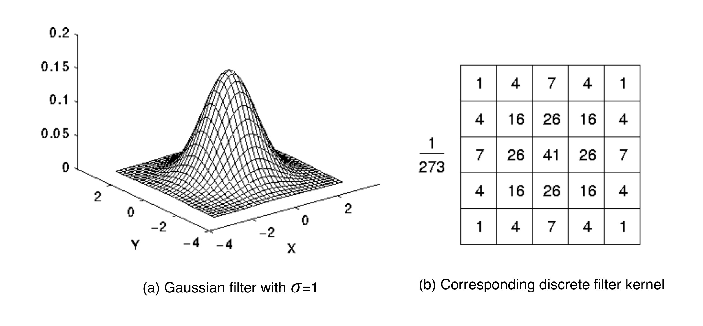
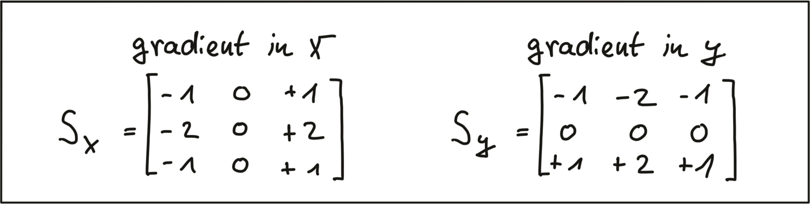
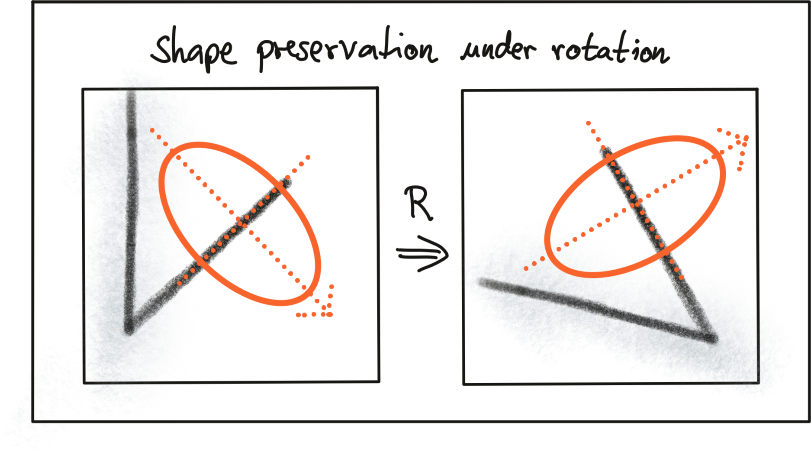
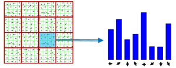
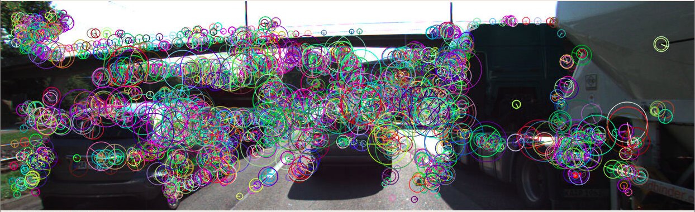
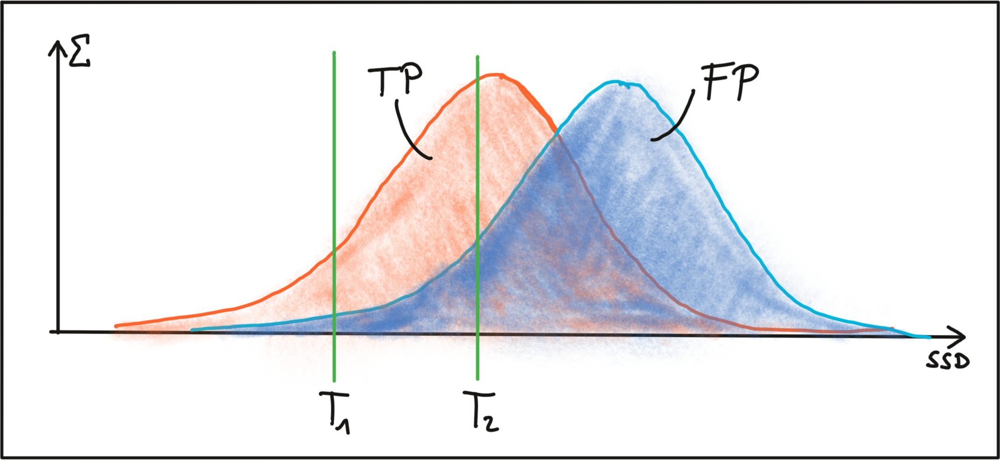

# Tracking Image Features

## Intensity Gradient and Filtering

### Locating Keypoints in an Image

In order to precisely locate a keypoint in an image, we need a way to assign them a unique coordinate in both x an y. Not all of the above patches lend themselves to this goal. Both the corner as well as the ellipse can be positioned accurately in x and y, the line in the leftmost image can not.


### The Intensity Gradient

In the above examples, the contrast between neighboring pixels contains the information we need : In order to precisely locate e.g. the corner in the middle patch, we do not need to know its color but instead we require the color difference between the pixels that form the corner to be as high as possible. An ideal corner would consist of only black and white pixels.

The figure below shows the intensity profile of all pixels along the red line in the image as well as the intensity gradient, which is the derivative of image intensity.

Image Filters and Gaussian Smoothing

### Image Filters and Gaussian Smoothing

Gaussian smoothing works by assigning each pixel a weighted sum of the surrounding pixels based on the height of the Gaussian curve at each point. The largest contribution will come from the center pixel itself, whereas the contribution from the pixels surroundings will decrease depending on the height of the Gaussian curve and thus its standard deviation. It can easily be seen that the contribution of the surrounding pixels around the center location increases when the standard deviation is large (left image).

Applying the Gaussian filter (or any other filter) works in four successive steps which are illustrated by the figure below:

1. Create a filter kernel with the desired properties (e.g. Gaussian smoothing or edge detection)
2. Define the anchor point within the kernel (usually the center position) and place it on top of the first pixel of the image.
3. Compute the sum of the products of kernel coefficients with the corresponding image pixel values beneath.
4. Place the result to the location of the kernel anchor in the input image.
5. Repeat the process for all pixels over the entire image.

The following figure illustrates the process of shifting the (yellow) filter kernel over the image row by row and assigning the result of the two-dimensional sum H(x,y)*H*(*x*,*y*) to every pixel location.


A filter kernel for Gaussian smoothing is shown in the next figure. In (a), a 3D Gaussian curve is shown and in (b), the corresponding discrete filter kernel can be seen with a central anchor point (41) corresponding to the maximum of the Gaussian curve and with decreasing values towards the edges in a (approximately) circular shape.



## Exercise

```c++
void gaussianSmoothing1()
{
    // load image from file
    cv::Mat img;
    img = cv::imread("../images/img1gray.png");

    // create filter kernel
    float gauss_data[25] = {1, 4, 7, 4, 1,
                            4, 16, 26, 16, 4,
                            7, 26, 41, 26, 7,
                            4, 16, 26, 16, 4,
                            1, 4, 7, 4, 1};
    
  
    // Normalize kernel filter
    for (int i = 0; i < 25; i++)
    {
        gauss_data[i] /= 273;
    }
  
    cv::Mat kernel = cv::Mat(5, 5, CV_32F, gauss_data);

    // apply filter
    cv::Mat result;
    cv::filter2D(img, result, -1, kernel, cv::Point(-1, -1), 0, cv::BORDER_DEFAULT);

    // show result
    string windowName = "Gaussian Blurring";
    cv::namedWindow(windowName, 1); // create window
    cv::imshow(windowName, result);
    cv::waitKey(0); // wait for keyboard input before continuing
}
```


## Computing the Intensity Gradient

After smoothing the image slightly to reduce the influence of noise, we can now compute the intensity gradient of the image in both x and y direction. In the literature, there are several approaches to gradient computation to be found. Among the most famous it the `Sobel` operator (proposed in 1968), but there are several others, such as the `Scharr` operator, which is optimized for rotational symmetry.

The Sobel operator is based on applying small integer-valued filters both in horizontal and vertical direction. The operators are 3x3 kernels, one for the gradient in x and one for the gradient in y. Both kernels are shown below.



```c++
    // load image from file
    cv::Mat img;
    img = cv::imread("./img1.png");

    // convert image to grayscale
    cv::Mat imgGray;
    cv::cvtColor(img, imgGray, cv::COLOR_BGR2GRAY);

    // create filter kernel
    float sobel_x[9] = {-1, 0, +1,
                        -2, 0, +2, 
                        -1, 0, +1};
    cv::Mat kernel_x = cv::Mat(3, 3, CV_32F, sobel_x);

    // apply filter
    cv::Mat result_x;
    cv::filter2D(imgGray, result_x, -1, kernel_x, cv::Point(-1, -1), 0, cv::BORDER_DEFAULT);

    // show result
    string windowName = "Sobel operator (x-direction)";
    cv::namedWindow( windowName, 1 ); // create window 
    cv::imshow(windowName, result_x);
    cv::waitKey(0); // wait for keyboard input before continuing
```

## Exercise

```c++
void magnitudeSobel()
{
    // load image from file
    cv::Mat img;
    img = cv::imread("../images/img1gray.png");

    // convert image to grayscale
    cv::Mat imgGray;
    cv::cvtColor(img, imgGray, cv::COLOR_BGR2GRAY);

    // apply smoothing
    cv::Mat blurred = imgGray.clone();
    int filterSize = 5;
    int stdDev = 2.0;
    cv::GaussianBlur(imgGray, blurred, cv::Size(filterSize, filterSize), stdDev);

    // create filter kernels
    float sobel_x[9] = {-1, 0, +1, -2, 0, +2, -1, 0, +1};
    cv::Mat kernel_x = cv::Mat(3, 3, CV_32F, sobel_x);

    float sobel_y[9] = {-1, -2, -1, 0, 0, 0, +1, +2, +1};
    cv::Mat kernel_y = cv::Mat(3, 3, CV_32F, sobel_y);

    // apply filter
    cv::Mat result_x, result_y;
    cv::filter2D(blurred, result_x, -1, kernel_x, cv::Point(-1, -1), 0, cv::BORDER_DEFAULT);
    cv::filter2D(blurred, result_y, -1, kernel_y, cv::Point(-1, -1), 0, cv::BORDER_DEFAULT);

    // compute magnitude image
    cv::Mat magnitude = imgGray.clone();
    for (int r = 0; r < magnitude.rows; r++)
    {
        for (int c = 0; c < magnitude.cols; c++)
        {
            magnitude.at<unsigned char>(r, c) = sqrt(pow(result_x.at<unsigned char>(r, c), 2) +
                                                     pow(result_y.at<unsigned char>(r, c), 2));
        }
    }

    // show result
    string windowName = "Gaussian Blurring";
    cv::namedWindow(windowName, 1); // create window
    cv::imshow(windowName, magnitude);
    cv::waitKey(0); // wait for keyboard input before continuing
}
```


## Harris Corner Detection


```c++
    // load image from file
    cv::Mat img;
    img = cv::imread("./img1.png");

    // convert image to grayscale
    cv::Mat imgGray; 
    cv::cvtColor(img, imgGray, cv::COLOR_BGR2GRAY);

    // Detector parameters
    int blockSize = 2; // for every pixel, a blockSize × blockSize neighborhood is considered
    int apertureSize = 3; // aperture parameter for Sobel operator (must be odd)
    int minResponse = 100; // minimum value for a corner in the 8bit scaled response matrix
    double k = 0.04; // Harris parameter (see equation for details)

    // Detect Harris corners and normalize output
    cv::Mat dst, dst_norm, dst_norm_scaled;
    dst = cv::Mat::zeros(imgGray.size(), CV_32FC1 );
    cv::cornerHarris( imgGray, dst, blockSize, apertureSize, k, cv::BORDER_DEFAULT ); 
    cv::normalize( dst, dst_norm, 0, 255, cv::NORM_MINMAX, CV_32FC1, cv::Mat() );
    cv::convertScaleAbs( dst_norm, dst_norm_scaled );

    // visualize results
    string windowName = "Harris Corner Detector Response Matrix";
    cv::namedWindow( windowName, 4 );
    cv::imshow( windowName, dst_norm_scaled );
    cv::waitKey(0);
```

The result can be seen below : The brighter a pixel, the higher the Harris corner response.

```c++
// Look for prominent corners and instantiate keypoints
vector<cv::KeyPoint> keypoints;
double maxOverlap = 0.0; // max. permissible overlap between two features in %, used during non-maxima suppression
for (size_t j = 0; j < dst_norm.rows; j++)
{
    for (size_t i = 0; i < dst_norm.cols; i++)
    {
        int response = (int)dst_norm.at<float>(j, i);
        if (response > minResponse)
        { // only store points above a threshold

            cv::KeyPoint newKeyPoint;
            newKeyPoint.pt = cv::Point2f(i, j);
            newKeyPoint.size = 2 * apertureSize;
            newKeyPoint.response = response;

            // perform non-maximum suppression (NMS) in local neighbourhood around new key point
            bool bOverlap = false;
            for (auto it = keypoints.begin(); it != keypoints.end(); ++it)
            {
                double kptOverlap = cv::KeyPoint::overlap(newKeyPoint, *it);
                if (kptOverlap > maxOverlap)
                {
                    bOverlap = true;
                    if (newKeyPoint.response > (*it).response)
                    {                      // if overlap is >t AND response is higher for new kpt
                        *it = newKeyPoint; // replace old key point with new one
                        break;             // quit loop over keypoints
                    }
                }
            }
            if (!bOverlap)
            {                                     // only add new key point if no overlap has been found in previous NMS
                keypoints.push_back(newKeyPoint); // store new keypoint in dynamic list
            }
        }
    } // eof loop over cols
}     // eof loop over rows

// visualize keypoints
windowName = "Harris Corner Detection Results";
cv::namedWindow(windowName, 5);
cv::Mat visImage = dst_norm_scaled.clone();
cv::drawKeypoints(dst_norm_scaled, keypoints, visImage, cv::Scalar::all(-1), cv::DrawMatchesFlags::DRAW_RICH_KEYPOINTS);
cv::imshow(windowName, visImage);
cv::waitKey(0);
// EOF STUDENT CODE
```


## Keypoint Detectors

### Invariance to Photometric and Geometric Changes

There are four basic transformation types we need to think about when selecting a suitable keypoint detector:

1. Rotation
2. Scale change
3. Intensity change
4. Affine transformation

In the following, the above criteria are used to briefly assess the Harris corner detector.

Rotation R :



Intensity Change:


Scale change:


Summarizing, the Harris detector is robust under rotation and additive intensity shifts, but sensitive to scale change, multiplicative intensity shifts (i.e. changes in contrast) and affine transformations.


### Automatic Scale Selection

In order to detect keypoints at their ideal scale, we must know (or find) their respective dimensions in the image and adapt the size of the Gaussian window w(x,y)*w*(*x*,*y*) as introduced earlier in this section. If the keypoint scale is unknown or if keypoints with varying size exist in the image, detection must be performed successively at multiple scale levels.

### Overview of Popular Keypoint Detectors

Keypoint detectors are a very popular research area and thus a large number of powerful algorithms have been developed over the years. Applications of keypoint detection include such things as object recognition and tracking, image matching and panoramic stitching as well as robotic mapping and 3D modeling. In addition to invariance under the transformations mentioned above, detectors can be compared for their detection performance and their processing speed.

The Harris detector along with several other "classics" belongs to a group of traditional detectors, which aim at maximizing detection accuracy. In this group, computational complexity is not a primary concern. The following list shows a number of popular classic detectors :

- 1988 Harris Corner Detector (Harris, Stephens)
- 1996 Good Features to Track (Shi, Tomasi)
- 1999 Scale Invariant Feature Transform (Lowe)
- 2006 Speeded Up Robust Features (Bay, Tuytelaars, Van Gool)

In recent years, a number of faster detectors has been developed which aims at real-time applications on smartphones and other portable devices. The following list shows the most popular detectors belonging to this group:

- 2006 Features from Accelerated Segment Test (FAST) (Rosten, Drummond)
- 2010 Binary Robust Independent Elementary Features (BRIEF) (Calonder, et al.)
- 2011 Oriented FAST and Rotated BRIEF (ORB) (Rublee et al.)
- 2011 Binary Robust Invariant Scalable Keypoints (BRISK) (Leutenegger, Chli, Siegwart)
- 2012 Fast Retina Keypoint (FREAK) (Alahi, Ortiz, Vandergheynst)
- 2012 KAZE (Alcantarilla, Bartoli, Davidson)

### Exercise

Before we go into details on the above-mentioned detectors in the next section, use the OpenCV library to add the **FAST** detector in addition to the already implemented **Shi-Tomasi** detector and compare both algorithms with regard to (a) number of keypoints, (b) distribution of keypoints over the image and (c) processing speed. Describe your observations with a special focus on the preceding vehicle.

```c++
void detKeypoints1()
{
    // load image from file and convert to grayscale
    cv::Mat imgGray;
    cv::Mat img = cv::imread("../images/img1.png");
    cv::cvtColor(img, imgGray, cv::COLOR_BGR2GRAY);

    // Shi-Tomasi detector
    int blockSize = 6;       //  size of a block for computing a derivative covariation matrix over each pixel neighborhood
    double maxOverlap = 0.0; // max. permissible overlap between two features in %
    double minDistance = (1.0 - maxOverlap) * blockSize;
    int maxCorners = img.rows * img.cols / max(1.0, minDistance); // max. num. of keypoints
    double qualityLevel = 0.01;                                   // minimal accepted quality of image corners
    double k = 0.04;
    bool useHarris = false;

    vector<cv::KeyPoint> kptsShiTomasi;
    vector<cv::Point2f> corners;
    double t = (double)cv::getTickCount();
    cv::goodFeaturesToTrack(imgGray, corners, maxCorners, qualityLevel, minDistance, cv::Mat(), blockSize, useHarris, k);
    t = ((double)cv::getTickCount() - t) / cv::getTickFrequency();
    cout << "Shi-Tomasi with n= " << corners.size() << " keypoints in " << 1000 * t / 1.0 << " ms" << endl;

    for (auto it = corners.begin(); it != corners.end(); ++it)
    { // add corners to result vector

        cv::KeyPoint newKeyPoint;
        newKeyPoint.pt = cv::Point2f((*it).x, (*it).y);
        newKeyPoint.size = blockSize;
        kptsShiTomasi.push_back(newKeyPoint);
    }

    // visualize results
    cv::Mat visImage = img.clone();
    cv::drawKeypoints(img, kptsShiTomasi, visImage, cv::Scalar::all(-1), cv::DrawMatchesFlags::DRAW_RICH_KEYPOINTS);
    string windowName = "Shi-Tomasi Results";
    cv::namedWindow(windowName, 1);
    imshow(windowName, visImage);
    cv::waitKey(0);

    // TODO: use the OpenCV library to add the FAST detector
    // in addition to the already implemented Shi-Tomasi 
    // detector and compare both algorithms with regard to 
    // (a) number of keypoints, (b) distribution of 
    // keypoints over the image and (c) processing speed.
  
    int threshold = 30;                                                              // difference between intensity of the central pixel and pixels of a circle around this pixel
    bool bNMS = true;                                                                // perform non-maxima suppression on keypoints
    cv::FastFeatureDetector::DetectorType type = cv::FastFeatureDetector::TYPE_9_16; // TYPE_9_16, TYPE_7_12, TYPE_5_8
    cv::Ptr<cv::FeatureDetector> detector = cv::FastFeatureDetector::create(threshold, bNMS, type);

    vector<cv::KeyPoint> kptsFAST;
    t = (double)cv::getTickCount();
    detector->detect(imgGray, kptsFAST);
    t = ((double)cv::getTickCount() - t) / cv::getTickFrequency();
    cout << "FAST with n= " << kptsFAST.size() << " keypoints in " << 1000 * t / 1.0 << " ms" << endl;

    visImage = img.clone();
    cv::drawKeypoints(img, kptsFAST, visImage, cv::Scalar::all(-1), cv::DrawMatchesFlags::DRAW_RICH_KEYPOINTS);
    windowName = "FAST Results";
    cv::namedWindow(windowName, 2);
    imshow(windowName, visImage);
    cv::waitKey(0);
}
```

## Gradient-based vs. Binary Descriptors

### Detectors and Descriptors

Let us refine our terminology at this point :

- A *keypoint* (sometimes also interest point or salient point) detector is an algorithm that chooses points from an image based on a local maximum of a function, such as the "cornerness" metric we saw with the Harris detector.
- A *descriptor* is a vector of values, which describes the image patch around a keypoint. There are various techniques ranging from comparing raw pixel values to much more sophisticated approaches such as histograms of gradient orientations.


### SIFT

In the following, we will take a brief look at the family of descriptors based on Histograms of Oriented Gradients (HOG). The basic idea behind HOG is to describe the structure of an object by the distribution its intensity gradients in a local neighborhood. To achieve this, an image is divided into cells in which gradients are computed and collected in a histogram. The set of histogram from all cells is then used as a similarity measure to uniquely identify an image patch or object.

One of the best-known examples of the HOG family is the Scale-Invariant Feature Transform (SIFT), introduced in 1999 by David Lowe. The SIFT method includes both a keypoint detector as well as a descriptor and it follows a five-step process, which is briefly outlined in the following.

1. First, keypoints are detected in the image using an approach called „Laplacian-Of-Gaussian (LoG)“, which is based on second-degree intensity derivatives. The LoG is applied to various scale levels of the image and tends to detect blobs instead of corners. In addition to a unique scale level, keypoints are also assigned an orientation based on the intensity gradients in a local neighborhood around the keypoint.
2. Second, for every keypoint, its surrounding area is transformed by removing the orientation and thus ensuring a *canonical orientation*. Also, the size of the area is resized to 16 x 16 pixels, providing a normalized patch.

3. Third, the orientation and magnitude of each pixel within the normalized patch are computed based on the intensity gradients Ix and Iy.
4. Fourth, the normalized patch is divided into a grid of 4 x 4 cells. Within each cell, the orientations of pixels which exceed a threshold on magnitude are collected in a histogram consisting of 8 bins.
5. Last, the 8-bin histograms of all 16 cells are concatenated into a 128-dimensional vector (the descriptor) which is used to uniquely represent the keypoint.





The SIFT detector / descriptor is able to robustly identify objects even among clutter and under partial occlusion. It is invariant to uniform changes in scale, to rotation, to changes in both brightness and contrast and it is even partially invariant to affine distortions.

The downside of SIFT is its low speed, which prevents it from being used in real-time applications on e.g. smartphones. Other members of the HOG family (such as SURF and GLOH), have been optimized for speed. However, they are still too computationally expensive and should not be used in real-time applications. Also, SIFT and SURF are heavily patented, so they can’t be freely used in a commercial context. In order to use SIFT in the OpenCV, you have to `#include <opencv2/xfeatures2d/nonfree.hpp>`, which further emphasizes this issue.

A much faster (and free) alternative to HOG-based methods is the family of binary descriptors, which provide a fast alternative at only slightly worse accuracy and performance. Let us take a look at those in the next section.


### Binary Descriptors and BRISK

The problem with HOG-based descriptors is that they are based on computing the intensity gradients, which is a very costly operation. Even though there have been some improvements such as SURF, which uses the integral image instead, these methods do not lend themselves to real-time applications on devices with limited processing capabilities (such as smartphones).

The central idea of binary descriptors is to rely solely on the intensity information (i.e. the image itself) and to encode the information around a keypoint in a string of binary numbers, which can be compared very efficiently in the matching step, when corresponding keypoints are searched. Currently, the most popular binary descriptors are BRIEF, BRISK, ORB, FREAK and KAZE (all available in the OpenCV library).

From a high-level perspective, binary descriptors consist of three major parts:

1. A **sampling pattern** which describes where sample points are located around the location of a keypoint.
2. A method for **orientation compensation**, which removes the influence of rotation of the image patch around a keypoint location.
3. A method for **sample-pair selection**, which generates pairs of sample points which are compared against each other with regard to their intensity values. If the first value is larger than the second, we write a '1' into the binary string, otherwise we write a '0'. After performing this for all point pairs in the sampling pattern, a long binary chain (or ‚string‘) is created (hence the family name of this descriptor class).


In the following, the "Binary Robust Invariant Scalable Keypoints (BRISK)" keypoint detector / descriptor is used as a representative for the binary descriptor family. Proposed in 2011 by Stefan Leutenegger et al., BRISK is a FAST-based detector in combination with a binary descriptor created from intensity comparisons retrieved by dedicated sampling of each keypoint neighborhood.

The sampling pattern of BRISK is composed out of a number of sample points (blue), where a concentric ring (red) around each sample point denotes an area where Gaussian smoothing is applied. As opposed to some other binary descriptors such as ORB or BRIEF, the BRISK sampling pattern is fixed. The smoothing is important to avoid aliasing (an effect that causes different signals to become indistinguishable - or aliases of one another - when sampled).


During sample pair selection, the BRISK algorithm differentiates between long- and short-distance pairs. The long-distance pairs (i.e. sample points with a minimal distance between each other on the sample pattern) are used for estimating the orientation of the image patch from intensity gradients, whereas the short-distance pairs are used for the intensity comparisons from which the descriptor string is assembled. Mathematically, the pairs are expressed as follows:


First, we define the set A of all possible pairings of sample points. Then, we extract the subset L from A for which the euclidean distance is above a pre-defined upper threshold. This set are the long-distance pairs used for orientation estimation. Lastly, we extract those pairs from A whose euclidean distance is below a lower threshold. This set S contains the short-distance pairs for assembling the binary descriptor string.

The following figure shows the two types of distance pairs on the sampling pattern for short pairs (left) and long pairs (right).


[based on this [source](https://classroom.udacity.com/nanodegrees/nd313/parts/1971021c-523b-414c-93a3-2c6297cf4771/modules/0a71c48d-96ab-4d3a-be96-3ea1e64cf773/lessons/53855af9-95ad-41f6-bb0f-7e5464baa34b/concepts/based on https://www.cse.unr.edu/~bebis/CS491Y/Lectures/BRISK.pptx) ]


From the long pairs, the keypoint direction vector \vec{g}*g*⃗ is computed as follows:


First, the gradient strength between two sample points is computed based on the normalized unit vector that gives the direction between both points multiplied with the intensity difference of both points at their respective scales. In (2), the keypoint direction vector \vec{g}*g*⃗ is then computed from the sum of all gradient strengths.

Based on \vec{g}*g*⃗, we can use the direction of the sample pattern to rearrange the short-distance pairings and thus ensure rotation invariance. Based on the rotation-invariant short-distance pairings, the final binary descriptor can be constructed as follows:


After computing the orientation angle of the keypoint from g, we use it to make the short-distance pairings invariant to rotation. Then, the intensity between all pairs in S*S* is compared and used to assemble the binary descriptor we can use for matching.


### HOG (SIFT) vs. Binary (BRISK) Exercise

```c++
void descKeypoints1()
{
    // load image from file and convert to grayscale
    cv::Mat imgGray;
    cv::Mat img = cv::imread("../images/img1.png");
    cv::cvtColor(img, imgGray, cv::COLOR_BGR2GRAY);

    // BRISK detector / descriptor
    cv::Ptr<cv::FeatureDetector> detectorBRISK = cv::BRISK::create();
    vector<cv::KeyPoint> kptsBRISK;

    double t = (double)cv::getTickCount();
    detectorBRISK->detect(imgGray, kptsBRISK);
    t = ((double)cv::getTickCount() - t) / cv::getTickFrequency();
    cout << "BRISK detector with n= " << kptsBRISK.size() << " keypoints in " << 1000 * t / 1.0 << " ms" << endl;

    cv::Ptr<cv::DescriptorExtractor> descriptorBRISK = cv::BRISK::create();
    cv::Mat descBRISK;
    t = (double)cv::getTickCount();
    descriptorBRISK->compute(imgGray, kptsBRISK, descBRISK);
    t = ((double)cv::getTickCount() - t) / cv::getTickFrequency();
    cout << "BRISK descriptor in " << 1000 * t / 1.0 << " ms" << endl;

    // visualize results
    cv::Mat visImage = img.clone();
    cv::drawKeypoints(img, kptsBRISK, visImage, cv::Scalar::all(-1), cv::DrawMatchesFlags::DRAW_RICH_KEYPOINTS);
    string windowName = "BRISK Results";
    cv::namedWindow(windowName, 1);
    imshow(windowName, visImage);
    cv::waitKey(0);

    // TODO: Add the SIFT detector / descriptor, compute the 
    // time for both steps and compare both BRISK and SIFT
    // with regard to processing speed and the number and 
    // visual appearance of keypoints.
    // SIFT detector / descriptor
    cv::Ptr<cv::FeatureDetector> detectorSIFT = cv::xfeatures2d::SIFT::create();
    vector<cv::KeyPoint> kptsSIFT;

    t = (double)cv::getTickCount();
    detectorSIFT->detect(imgGray, kptsSIFT);
    t = ((double)cv::getTickCount() - t) / cv::getTickFrequency();
    cout << "SIFT detector with n= " << kptsSIFT.size() << " keypoints in " << 1000 * t / 1.0 << " ms" << endl;

    cv::Ptr<cv::DescriptorExtractor> descriptorSIFT = cv::xfeatures2d::SiftDescriptorExtractor::create();
    cv::Mat descSIFT;
    t = (double)cv::getTickCount();
    descriptorSIFT->compute(imgGray, kptsSIFT, descSIFT);
    t = ((double)cv::getTickCount() - t) / cv::getTickFrequency();
    cout << "SIFT descriptor in " << 1000 * t / 1.0 << " ms" << endl;
  
    // visualize results
    visImage = img.clone();
    cv::drawKeypoints(img, kptsSIFT, visImage, cv::Scalar::all(-1), cv::DrawMatchesFlags::DRAW_RICH_KEYPOINTS);
    windowName = "SIFT Results";
    cv::namedWindow(windowName, 1);
    imshow(windowName, visImage);
    cv::waitKey(0);
}
```

**BRISK Result**

```bash
BRISK detector with n= 2896 keypoints in 49.503 ms
BRISK descriptor in 33.6497 ms
```



**SIFT Result**

```bash
SIFT detector with n= 1890 keypoints in 180.182 ms
SIFT descriptor in 202.721 ms
```


## Descriptor Matching

### Distance between descriptors

 In this section, we want to look at several ways to compute the distance between two descriptors such that the differences between them are transformed into a single number which we can use as a simple measure of similarity.


The key takeaway here is that you have to adapt the distance measure to the type of descriptor you are using. In case of gradient-based methods such as SIFT, the L2-norm would be most appropriate. In case of all binary descriptors, the Hamming distance should be used.

### Finding matches

**Brute Force Matching / Nearest Neighbor Matching**

Let us assume we have N keypoints and their associated descriptors in one image and M keypoints in another image. The most obvious method to look for corresponding pairs would be to compare all features with each other, i.e. perform N x M comparisons. For a given keypoint from the first image, it takes every keypoint in the second image and calculates the distance. The keypoint with the smallest distance will be considered its pair. This approach is referred to as Brute Force Matching or Nearest Neighbor Matching and is available in the OpenCV under the name BFMatcher. 

**Fast library for approximate nearest neighbors (FLANN)**

FLANN trains an indexing structure for walking through potential matching candidates that is created using concepts from machine learning. The library builds a very efficient data structure (a KD-tree) to search for matching pairs and avoids the exhaustive search of the brute force approach.

Both BFMatching and FLANN accept a descriptor distance threshold T which is used to limit the number of matches to the ‚good‘ ones and discard matches where the respective pairs are no correspondences.



The first threshold T1 is set to a maximally permissible SSD between two features in a way that some true positive matches are selected, while false positive matches are almost entirely avoided . However, most TP matches are also discarded with this setting. By increasing the matching threshold to T2, more TP matches are selected but the number of FP matches also increases significantly. In practice, a clear and concise separation of TP and FP is almost never found and therefore, setting a matching threshold is always a compromise between balancing 'good' vs. 'bad' matches. While FP matches can not be avoided in most cases, the goal always is to lower their number as much as possible. In the following, two strategies to achieve this are presented.


### Selecting Matches

**Cross check on both directions**

As long as the selected threshold T is not exceeded, brute force matching will always return a match for a keypoint in the first image, even if the keypoint is not present in the second image. This inevitably leads to a number of false matches. A strategy to counteract this is called cross check matching, which works by applying the matching procedure in both directions and keeping only those matches whose best match in one direction equals the best match in the other direction. The steps of the cross check approach are:

1. For each descriptor in the source image, find one or more best matches in the reference image.
2. Switch the order of source and reference image.
3. Repeat the matching procedure between source and reference image from step 1.
4. Select those keypoint pairs whose descriptors are best matches in both directions.

**Reject repetitive matchings**

A very efficient way of lowering the number of false positives is to compute the *nearest neighbor distance ratio* for each keypoint. This method has been originally proposed by D. Lowe in the 1999 paper on SIFT. The main idea is to not apply the threshold on the SSD directly. Instead, for each keypoint in the source image, the two best matches are located in the reference image and the ratio between the descriptor distances is computed. Then, a threshold is applied to the ratio to sort out ambiguous matches. The figure below illustrates the principle.

In the example, an image patch with an associated descriptor da is compared to two other image patches with descriptors d_{b_1}*d**b*1 and d_{b_2}*d**b*2. As can be seen, the patches look very similar and would result in ambiguous and thus unreliable matches. By computing the SSD ratio between best and second-best match, such weak candidates can be filtered out.

In practice, a threshold value of 0.8 has proven to provide a good balance between TP and FP. In the image sequences examined in the original SIFT paper, 90% of the false matches were eliminated with this setting while less than 5% of correct matches were lost.

### Exercise

1. Load the 'BRISK_small' dataset with cross-check first turned off, then on. Look at the visualized keypoint matches and at the number of matched pairs and describe your results.
2. Add the k-nearest-neighbor matching (using `cv::knnMatch`) with k=2 and implement the above-described descriptor distance ratio to filter out ambiguous matches with the threshold set to 0.8. Visualize the results, count the percentage of discarded matches (for both the 'BRISK_small' and the 'BRISK_large' dataset) and describe your observations.
3. Use both BF matching and FLANN matching on the 'BRISK_large' dataset and on the SIFT dataset and describe your observations.

```c++
void matchDescriptors(cv::Mat &imgSource, cv::Mat &imgRef, vector<cv::KeyPoint> &kPtsSource, vector<cv::KeyPoint> &kPtsRef, cv::Mat &descSource, cv::Mat &descRef,
                      vector<cv::DMatch> &matches, string descriptorType, string matcherType, string selectorType)
{

    // configure matcher
    bool crossCheck = false;
    cv::Ptr<cv::DescriptorMatcher> matcher;

    if (matcherType.compare("MAT_BF") == 0)
    {

        int normType = descriptorType.compare("DES_BINARY") == 0 ? cv::NORM_HAMMING : cv::NORM_L2;
        matcher = cv::BFMatcher::create(normType, crossCheck);
        cout << "BF matching cross-check=" << crossCheck;
    }
    else if (matcherType.compare("MAT_FLANN") == 0)
    {
        if (descSource.type() != CV_32F)
        { // OpenCV bug workaround : convert binary descriptors to floating point due to a bug in current OpenCV implementation
            descSource.convertTo(descSource, CV_32F);
            descRef.convertTo(descRef, CV_32F);
        }

        //... TODO : implement FLANN matching
        matcher = cv::DescriptorMatcher::create(cv::DescriptorMatcher::FLANNBASED);
        cout << "FLANN matching";
    }

    // perform matching task
    if (selectorType.compare("SEL_NN") == 0)
    { // nearest neighbor (best match)

        double t = (double)cv::getTickCount();
        matcher->match(descSource, descRef, matches); // Finds the best match for each descriptor in desc1
        t = ((double)cv::getTickCount() - t) / cv::getTickFrequency();
        cout << " (NN) with n=" << matches.size() << " matches in " << 1000 * t / 1.0 << " ms" << endl;
    }
    else if (selectorType.compare("SEL_KNN") == 0)
    { // k nearest neighbors (k=2)

        // TODO : implement k-nearest-neighbor matching
        vector<vector<cv::DMatch>> knn_matches;
        double t = (double)cv::getTickCount();
        matcher->knnMatch(descSource, descRef, knn_matches, 2); // Finds the best match for each descriptor in desc1
        t = ((double)cv::getTickCount() - t) / cv::getTickFrequency();
        cout << " (KNN) with n=" << knn_matches.size() << " matches in " << 1000 * t / 1.0 << " ms" << endl;

        // TODO : filter matches using descriptor distance ratio test
        double minDescDistRatio = 0.8;
        for (auto it = knn_matches.begin(); it != knn_matches.end(); ++it)
        {

            if ((*it)[0].distance < minDescDistRatio * (*it)[1].distance)
            {
                matches.push_back((*it)[0]);
            }
        }
        cout << "# keypoints removed = " << knn_matches.size() - matches.size() << endl;
    }

    // visualize results
    cv::Mat matchImg = imgRef.clone();
    cv::drawMatches(imgSource, kPtsSource, imgRef, kPtsRef, matches,
                    matchImg, cv::Scalar::all(-1), cv::Scalar::all(-1), vector<char>(), cv::DrawMatchesFlags::DRAW_RICH_KEYPOINTS);

    string windowName = "Matching keypoints between two camera images (best 50)";
    cv::namedWindow(windowName, 7);
    cv::imshow(windowName, matchImg);
    cv::waitKey(0);
}

int main()
{
    cv::Mat imgSource = cv::imread("../images/img1gray.png");
    cv::Mat imgRef = cv::imread("../images/img2gray.png");

    vector<cv::KeyPoint> kptsSource, kptsRef; 
    readKeypoints("../dat/C35A5_KptsSource_BRISK_large.dat", kptsSource);
    readKeypoints("../dat/C35A5_KptsRef_BRISK_large.dat", kptsRef);

    cv::Mat descSource, descRef; 
    readDescriptors("../dat/C35A5_DescSource_BRISK_large.dat", descSource);
    readDescriptors("../dat/C35A5_DescRef_BRISK_large.dat", descRef);

    vector<cv::DMatch> matches;
    string matcherType = "MAT_FLANN"; // MAT_BF, MAT_FLANN
    string descriptorType = "DES_BINARY"; // DES_BINARY, DES_HOG
    string selectorType = "SEL_KNN"; // SEL_NN, SEL_KNN 
    matchDescriptors(imgSource, imgRef, kptsSource, kptsRef, descSource, descRef, matches, descriptorType, matcherType, selectorType);
}
```

**Response**

```
50% of the matches are discarded by using KNN Match with a 0.8 distance threshold. Most of the FP are discarded efficiently. 

FLANN performed 4 times faster on larger dataset but the same for small dataset.
```


### Evaluating Matching Performance

The *Receiver Operating Characteristic (ROC)* is a graphical plot that shows how well a detector / descriptor is able to differentiate between true and false matches as its discrimination threshold is varied. The following figure shows how the ROC is constructed from the distribution of true positives and false positives by varying the discrimination threshold on the SSD. An ideal detector / descriptor would have a TPR of 1.0 while the FPR would be close to 0.0 at the same time.


In the following figure, two examples for good and bad detectors / descriptors are shown. In the first example, there is no way of safely differentiating between TP and FP as both curves match and changes in the discrimination threshold would affect them in the same way. In the second example, the TP and FP curve do not overlap significantly and therefore, a suitable discriminator threshold can be selected.


To conclude this section, an overview of results is given, where several descriptors have been compared against each other and which can be used to facilitate the selection process when detectors / descriptors have to be chosen for an application. In the graph, you can see the ROC curves of different descriptors such as SIFT, BRISK and several others and visually compare them against each other. Note that those results are only valid for the image sequences actually used for the comparison - for a different image set, e.g. a traffic scene, results may vary significantly.

