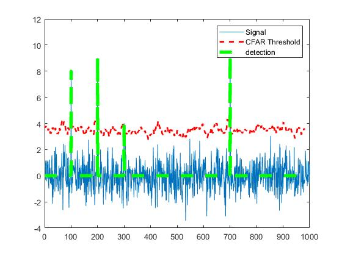
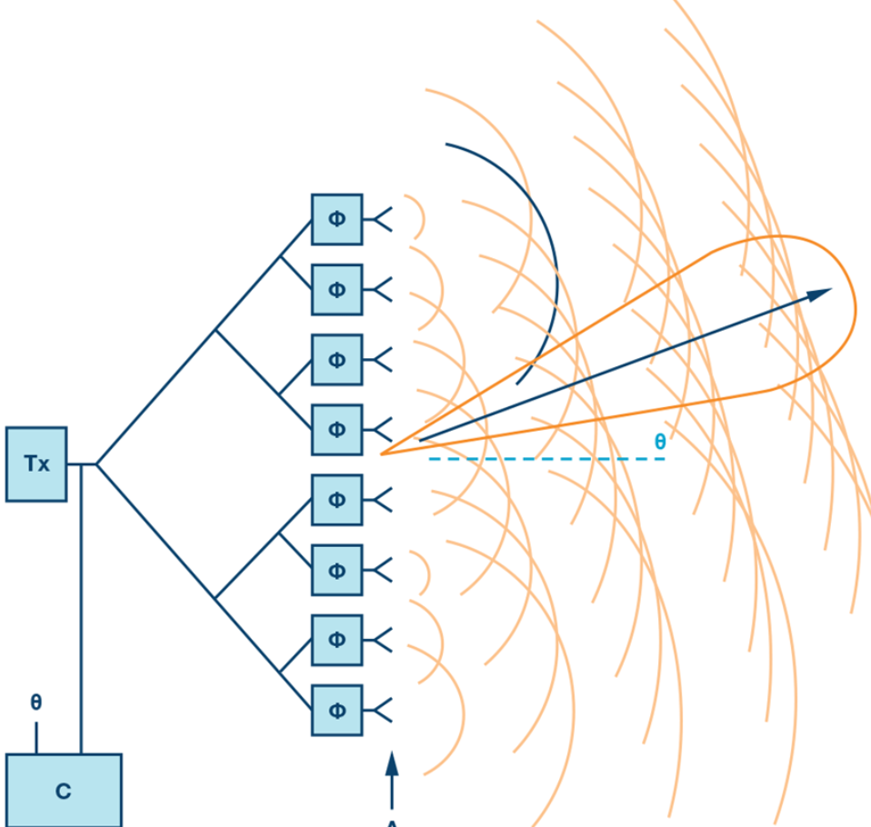
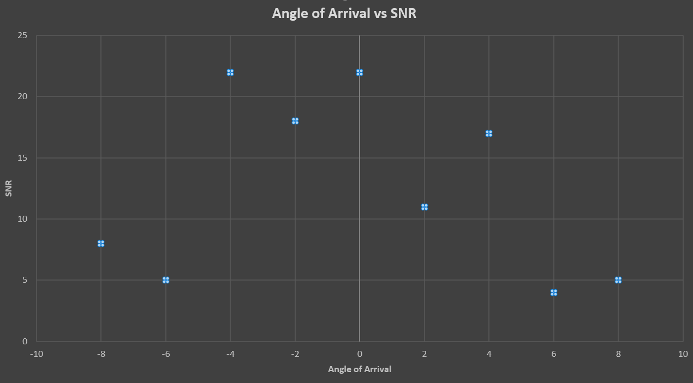
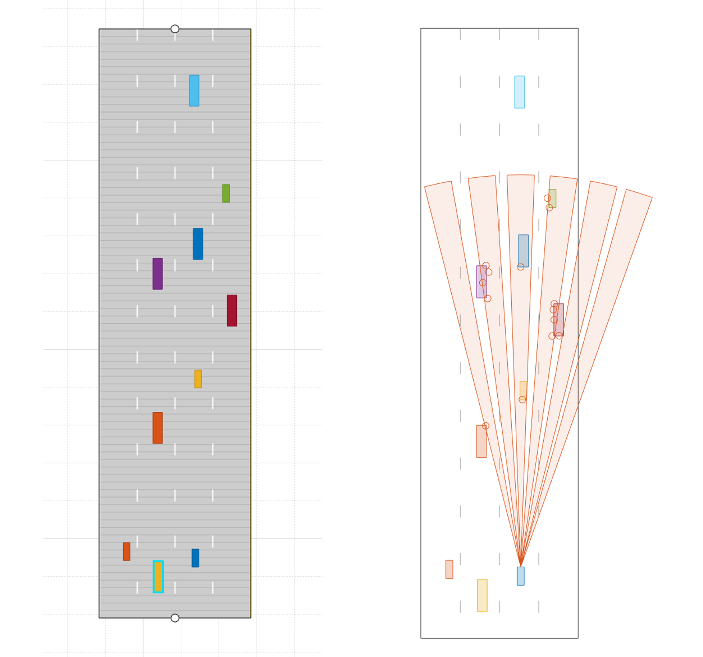

# Clutter, CFAR, AoA

## Clutter

Radar not only receive the reflected signals from the objects of interest, but also from the environment and unwanted objects. The backscatter from these unwanted sources is called as clutter.

These unwanted signals are generally produced by the reflections from the ground, sea, buildings, trees, rain, fog etc. The magnitude of the clutter signal depends upon:

- The nature of the surface - ground, water, snow (e.g deserts have low reflectivity, whereas the frozen snow has high reflectivity)
- Smoothness of the surface
- Grazing angle - Angle the radar beam makes with the surface
- Radar Frequency


## Clutter Thresholding


It is important to filter out clutter for successful detection of targets. This is critical in a driving scenario to avoid the car from suddenly braking in the absence of valid targets. This sudden braking happens when the radar detects reflections that are generated from the clutter.

One technique to remove clutter is to remove the signals having 0 doppler velocity. Since, the clutter in the driving scenario are often created by the stationary targets, the 0 doppler filtering can help get rid of them.

The downside of 0 doppler filtering is that the radar would not be able to detect the stationary targets in its path. This would lead to detection failures.

Another technique is to use *fixed clutter thresholding*. With fixed thresholding, signal below the threshold value is rejected. With this method, if the detection threshold is set too high, there will be very few false alarms, but it will also mask the valid targets. If the threshold is set too low, then it would lead to too many false alarms. In other words, the *false alarm rate* would be too high.

The false alarm rate is the rate of erroneous radar detections by noise or other interfering signals. It is a measure of the presence of detected radar targets when there is no valid target present.


Fixed Threshold leading to False Alarms and missed detections of weak target

## Dynamic Thresholding

Another approach to clutter thresholding is to use *dynamic thresholding*. Dynamic thresholding involves varying the threshold level to reduce the false alarm rate.

In the rest of this lesson, you will learn about a dynamic thresholding technique called CFAR (Constant False Alarm Rate). With this technique, the noise at every or group of range/doppler bins is monitored and the signal is compared to the local noise level. This comparison is used create a threshold which holds the false alarm rate constant. Let's have a look in the next concept!


The false alarm issue can be resolved by implementing the constant false alarm rate. CFAR varies the detection threshold based on the vehicle surroundings. The CFAR technique estimates the level of interference in radar range and doppler cells “Training Cells” on either or both the side of the “Cell Under Test”. The estimate is then used to decide if the target is in the Cell Under Test (CUT).

The process loops across all the range cells and decides the presence of target based on the noise estimate.The basis of the process is that when noise is present, the cells around the cell of interest will contain a good estimate of the noise, i.e. it assumes that the noise or interference is spatially or temporarily homogeneous. Theoretically it will produce a constant false alarm rate, which is independent of the noise or clutter level

There are multiple categories of CFAR:

- Cell Averaging CFAR (CA-CFAR)
- Ordered Statistics CFAR (OS CFAR)
- Maximum Minimum Statistic (MAMIS CFAR)
- And, multiple variants of CA-CFAR.


## CA-CFAR


CA-CFAR is the most commonly used CFAR detection technique. As seen in the previous lesson, the FFT blocks are generated on implementing range and doppler FFTs across the number of chirps. The CFAR process includes the sliding of a window across the cells in FFT blocks. Each window consists of the following cells.

**Cell Under Test** : The cell that is tested to detect the presence of the target by comparing the signal level against the noise estimate (threshold).

**Training Cells** : The level of noise is measured over the Training Cells. The Training Cells can be divided into two regions, the cells lagging the CUT, called lagging Training Cells and the cells leading the CUT, called Leading Training Cells. The noise is estimated by averaging the noise under the training cells. In some cases either leading or lagging cell average is taken, while in the other the leading and lagging cell average is combined and the higher of two is considered for noise level estimate.

The number of training cells should be decided based on the environment. If a dense traffic scenario then the fewer training cells should be used, as closely spaced targets can impact the noise estimate.

**Guard Cells** : The cells just next to CUT are assigned as Guard Cells. The purpose of the Guard Cells is to avoid the target signal from leaking into the training cells that could adversely affect the noise estimate. The number of guard cells should be decided based on the leakage of the target signal out of the cell under test. If target reflections are strong they often get into surrounding bins.

**Threshold Factor (Offset)** : Use an offset value to scale the noise threshold. If the signal strength is defined in logarithmic form then add this offset value to the average noise estimate, else multiply it.


## 1D CFAR Exercise

The following steps here can be used to implement CFAR in the next MATLAB exercise. You can use the code template below to get started as well.

**T** : Number of Training Cells

**G** : Number of Guard Cells

**N** : Total number of Cells

1. Define the number of training cells and guard cells
2. Start sliding the window one cell at a time across the complete FFT 1D array. Total window size should be: 2(T+G)+CUT
3. For each step, sum the signal (noise) within all the leading or lagging training cells
4. Average the sum to determine the noise threshold
5. Using an appropriate offset value scale the threshold
6. Now, measure the signal in the CUT, which is T+G+1 from the window starting point
7. Compare the signal measured in 5 against the threshold measured in 4
8. If the level of signal measured in CUT is smaller than the threshold measured, then assign 0 value to the signal within CUT.


```matlab
% Implement 1D CFAR using lagging cells on the given noise and target scenario.

% Close and delete all currently open figures
close all;

% Data_points
Ns = 1000;

% Generate random noise
s=randn(Ns,1);

%Targets location. Assigning bin 100, 200, 300 and 700 as Targets with the amplitudes of 8, 9, 4, 11.
s([100 ,200, 300, 700])=[8 9 4 11];

%plot the output
plot(s);

% TODO: Apply CFAR to detect the targets by filtering the noise.

% 1. Define the following:
% 1a. Training Cells
% 1b. Guard Cells 
T = 15;
G = 2;

% Offset : Adding room above noise threshold for desired SNR 
offset=3.5;

% Vector to hold threshold values 
threshold_cfar = [];

%Vector to hold final signal after thresholding
signal_cfar = [];

% 2. Slide window across the signal length
for i = 1:(Ns-(G+T+1))     

    % 2. - 5. Determine the noise threshold by measuring it within the training cells
    noise_level = sum(s(i:i+T-1));
    threshold = (noise_level/T)+offset;
    threshold_cfar = [threshold_cfar, {threshold}];
    
    % 6. Measuring the signal within the CUT
    signal = s(i+T+G);

    % 8. Filter the signal above the threshold
    if (signal < threshold)
        signal = 0;
    end
    signal_cfar = [signal_cfar, {signal}];
end

% plot the filtered signal
plot (cell2mat(signal_cfar),'g--');

% plot original sig, threshold and filtered signal within the same figure.
figure,plot(s);
hold on,plot(cell2mat(circshift(threshold_cfar,G)),'r--','LineWidth',2)
hold on, plot (cell2mat(circshift(signal_cfar,(T+G))),'g--','LineWidth',4);
legend('Signal','CFAR Threshold','detection')
```

### Result



### Further Research

For further research, see the articles [here](http://www.radartutorial.eu/01.basics/False Alarm Rate.en.html) and [here](https://arxiv.org/pdf/1709.09786.pdf).


## CFAR 2D

The 2D CFAR is similar to 1D CFAR, but is implemented in both dimensions of the range doppler block. The 2D CA-CFAR implementation involves the training cells occupying the cells surrounding the cell under test with a guard grid in between to prevent the impact of a target signal on the noise estimate.



## 2D CFAR Steps

You won't need to implement a 2D-CFAR yet, but you will implement a 2D CFAR on the range doppler output for your final project! The following steps can be used to implement 2D-CFAR in MATLAB:

1. Determine the number of Training cells for each dimension Tr and Td. Similarly, pick the number of guard cells Gr and Gd.
2. Slide the Cell Under Test (CUT) across the complete cell matrix
3. Select the grid that includes the training, guard and test cells. Grid Size = (2Tr+2Gr+1)(2Td+2Gd+1).
4. The total number of cells in the guard region and cell under test. (2Gr+1)(2Gd+1).
5. This gives the Training Cells : (2Tr+2Gr+1)(2Td+2Gd+1) - (2Gr+1)(2Gd+1)
6. Measure and average the noise across all the training cells. This gives the threshold
7. Add the offset (if in signal strength in dB) to the threshold to keep the false alarm to the minimum.
8. Determine the signal level at the Cell Under Test.
9. If the CUT signal level is greater than the Threshold, assign a value of 1, else equate it to zero.
10. Since the cell under test are not located at the edges, due to the training cells occupying the edges, we suppress the edges to zero. Any cell value that is neither 1 nor a 0, assign it a zero.


### 2D CFAR Quiz

Determine the total number of training cells for 2D CFAR process given the following:

- Size of training band in range dimension = 8
- Size of guard band in range dimension = 4
- Size of training band in doppler dimension = 4
- Size of guard band in the doppler dimension = 2

```
(2Tr+2Gr+1)(2Td+2Gd+1) - (2Gr+1)(2Gd+1)
= (2*12+1)*(2*6+1)-(2*4+1)*(2*2+1) = 280
```

### Further Research

You can find out more about this [here](http://www.radartutorial.eu/01.basics/False Alarm Rate.en.html) and [here](https://arxiv.org/pdf/1709.09786.pdf).


## Angle of Arrival


A *phased array antenna* is an antenna array that steers the beam electronically in the desired direction. The array steers the beam if each antenna element in an array is excited by the signal with certain phase values. This phenomenon is referred to as beam scanning.


Beam Steering Design. Here the \PhiΦ represents the phase shifters. Phase shifters are the electronic components that changes the phase to make the beam steer in a desired direction.

For antenna beam to steer in a desired direction, the phase shifters are programmed to have constant phase increments. If an antenna comprises of six radiating elements and the phase delta required to steer a beam in a given direction is 15 degrees, then the following would be the phase value on each element [0,15,30,45,60,75] degrees. The increment phase shift along with the spacing between antenna elements (d) determines the steering angle of an antenna using the following equation

\Phi = 360\cdot d \cdot\sin(theta)/λΦ=360⋅*d*⋅sin(*t**h**e**t**a*)/*λ*

- \Phi=Φ= incremental phase shift
- d =*d*= spacing between antenna elements
- \theta=*θ*= steering direction from the normal of the antenna surface
- \lambda=*λ*= wavelength of the signal

As the radar scan the surroundings by steering the beam at the programmed angles, it can sense the angle of the return signal. This helps Radar create a spatial perception of the environment.




Radar Module for Automotive Applications from D3 Engineering

## Angle of Arrival




As the radar scans the surroundings by steering the beam at the programmed angles, it measures the SNR of reflected signals from targets located at different angles spatially. This helps in creating an angle of arrival vs SNR grid for radar’s spatial perception.


### Question

Determine the steering angle of an antenna beam in degrees for the given phase increment:

Frequency of operation = 77 GHz Speed of light = 3*10^8 m/s Phase increment = 45 degrees Antenna element spacing = wavelength/2

------

```
14.4775122
```

### Further Research

For more information about phased array antennas see [here](http://www.radartutorial.eu/06.antennas/Phased Array Antenna.en.html).