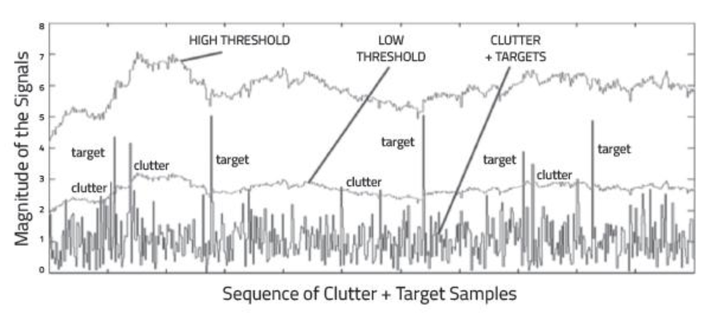

# Clutter, CFAR, AoA

## Clutter

Radar not only receive the reflected signals from the objects of interest, but also from the environment and unwanted objects. The backscatter from these unwanted sources is called as clutter.

These unwanted signals are generally produced by the reflections from the ground, sea, buildings, trees, rain, fog etc. The magnitude of the clutter signal depends upon:

- The nature of the surface - ground, water, snow (e.g deserts have low reflectivity, whereas the frozen snow has high reflectivity)
- Smoothness of the surface
- Grazing angle - Angle the radar beam makes with the surface
- Radar Frequency

## Clutter Thresholding

It is important to filter out clutter for successful detection of targets. This is critical in a driving scenario to avoid the car from suddenly braking in the absence of valid targets. This sudden braking happens when the radar detects reflections that are generated from the clutter.

One technique to remove clutter is to remove the signals having 0 doppler velocity. Since, the clutter in the driving scenario are often created by the stationary targets, the 0 doppler filtering can help get rid of them.

The downside of 0 doppler filtering is that the radar would not be able to detect the stationary targets in its path. This would lead to detection failures.

Another technique is to use *fixed clutter thresholding*. With fixed thresholding, signal below the threshold value is rejected. With this method, if the detection threshold is set too high, there will be very few false alarms, but it will also mask the valid targets. If the threshold is set too low, then it would lead to too many false alarms. In other words, the *false alarm rate* would be too high.

The false alarm rate is the rate of erroneous radar detections by noise or other interfering signals. It is a measure of the presence of detected radar targets when there is no valid target present.

Fixed Threshold leading to False Alarms and missed detections of weak target

## Dynamic Thresholding

Another approach to clutter thresholding is to use *dynamic thresholding*. Dynamic thresholding involves varying the threshold level to reduce the false alarm rate.

In the rest of this lesson, you will learn about a dynamic thresholding technique called CFAR (Constant False Alarm Rate). With this technique, the noise at every or group of range/doppler bins is monitored and the signal is compared to the local noise level. This comparison is used create a threshold which holds the false alarm rate constant. Let's have a look in the next concept!

CA-CFAR and OS-CFAR

The false alarm issue can be resolved by implementing the constant false alarm rate. CFAR varies the detection threshold based on the vehicle surroundings. The CFAR technique estimates the level of interference in radar range and doppler cells “Training Cells” on either or both the side of the “Cell Under Test”. The estimate is then used to decide if the target is in the Cell Under Test (CUT).

The process loops across all the range cells and decides the presence of target based on the noise estimate.The basis of the process is that when noise is present, the cells around the cell of interest will contain a good estimate of the noise, i.e. it assumes that the noise or interference is spatially or temporarily homogeneous. Theoretically it will produce a constant false alarm rate, which is independent of the noise or clutter level

There are multiple categories of CFAR:

- Cell Averaging CFAR (CA-CFAR)
- Ordered Statistics CFAR (OS CFAR)
- Maximum Minimum Statistic (MAMIS CFAR)
- And, multiple variants of CA-CFAR.