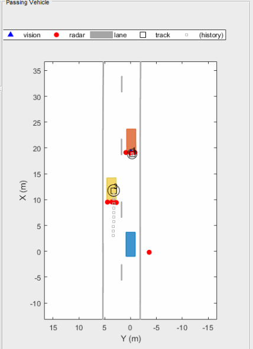
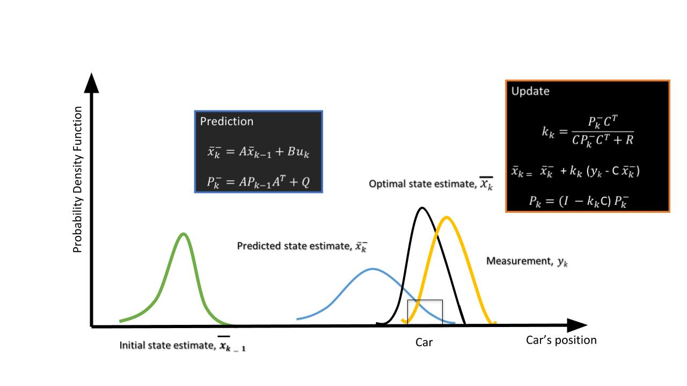

# Clustering and Tracking

## Clustering


For enhanced perception in autonomous driving, there is a need to track multiple targets separately. The object tracking is computationally expensive and tracking multiple targets simultaneously requires lots of processing power and memory.

Due to the advancements in radar technology and increasing sensing resolutions, a radar can generate detections from plentitude of scattering points on the target. If a tracker is assigned to every detection from the same target, then it can overburden the processing unit. Hence, it is important to cluster the detections from every target and assign a single track for each.

This is where the clustering algorithm becomes important for successful object tracking.

Here we will discuss the basic clustering algorithm based on the euclidean distance. The algorithm here groups the detection points based on their proximity measured by the euclidean distance between those points.

All the detection points that are within the size of the target are considered as one cluster, merged into a centroid position. Each cluster is now assigned a new range and velocity, which is the mean of measured range and velocity of all the detection points that form the cluster.

This allows valid tracking for each target.





Above is an illustration of the clustering scenario. In the image the blue car is an ego vehicle (vehicle with sensor) and the detections are generated from the orange and yellow vehicles. Using clustering algorithm all the detections associated with the single target are merged into one point. This helps in the detection and assigning the tracks to a target.


## Matlab Implementation of Clustering


The clustering implementation above uses the following steps:

1. If the detections are from same sensor, then loop through every single detection point and measure the euclidean distance between all of them.
2. Keep running the loop until the detection list is empty

Implement the following within the while loop:

1. Pick the first detection in the check list and check for its clustering neighbors.

2. If the distance between the first pick and remaining detections is less than the vehicle size, then group those detections and their respective radar sensor measurements, including range and velocity.

3. For the group, take the mean of the range and velocity measurements.

   **Note:** the radar measurement vector has 6 values - where range and velocity for x and y coordinates reside at indices 1,2, 4, and 5: `[x, y, - , Vx, Vy, -]`

1. Create a new Cluster ID. Then, assign all the group detections to the same ID.
2. Further, assign cluster, the mean range and velocity.
3. In the end, delete from the list the detections which have already been assigned to a cluster.
4. Keep repeating the process until the detection list is empty.


## Kalman Filter



\hat{x}_k*x*^*k*, the state of the vehicle at the k*k*th step.

A*A*, the state-transition model

P_k*P**k*, the state covariance matrix - state estimation covariance error

B*B*, control matrix - external influence

C*C*, the observation/measurement model

Q*Q*, the covariance of the process noise

R*R*, the covariance of the observation noise


The purpose of the Kalman filter is to estimate the *state* of a tracked vehicle. Here, "state" could include the position, velocity, acceleration or other properties of the vehicle being tracked. The Kalman filter uses measurements that are observed over time that contain noise or random variations and other inaccuracies, and produces values that tend to be closer to the true values of the measurements and their associated calculated values. It is the central algorithm to the majority of all modern radar tracking systems.

Here, we will be keeping the Kalman Filter limited to a basic introduction. You will be covering Kalman filters in detail in the fourth course of this Nanodegree program.

The Kalman filter process has two steps: prediction and update.

1. **Prediction Step**

   Using the target vehicle's motion model, the next state of the target vehicle is predicted by using the current state. Since we know the current position and velocity of the target from the previous timestamp, we can predict the position of the target for next timestamp.

   For example, using a constant velocity model, the new position of the target vehicle can be computed as:x_{new} = x_{prev} + v * t*x**n**e**w*=*x**p**r**e**v*+*v*∗*t*

1. **Update Step** :

   Here, the Kalman filter uses noisy measurement data from sensors, and combines the data with the prediction from the previous step to produce a best-possible estimate of the state.

## Kalman Tracking and MATLAB

The trackingKF class creates a discrete-time linear Kalman filter used for tracking positions and velocities of objects which can be encountered in an automated driving scenario, such as automobiles, pedestrians, bicycles, and stationary structures or obstacles.

You can learn more about different parameters for the filter [here](https://www.mathworks.com/help/driving/ref/trackingkf-class.html), and you can learn more about the theory behind Kalman filters [here](https://www.mathworks.com/help/driving/ug/linear-kalman-filters.html).

### Implementation in MATLAB

The following guidelines can be used to implement a basic Kalman filter for the next project.

- You will define the Kalman filter using the `trackingKF` function. The function signature is as follows:

  ```matlab
       filter = trackingKF('MotionModel', model, 'State', state, 'MeasurementModel', measurementModel, 'StateCovariance', stateCovrariance, 'MeasurementNoise', measurementNoise)
  ```

  In this function signature, each property (e.g. `'MotionModel`) is followed by the value for that property (e.g. `model`).

- For the `model` variable, you can pass the string `'2D Constant Velocity'`, which will provides the 2D constant velocity motion model.

- For the 2D constant velocity model the state vector (x) can be defined as:

  ```matlab
  [x;vx;y;vy]
  ```

  Here, `x` and `y` are 2D position coordinates. The variables`vx` and `vy` provide the velocity in 2D.

- A `RadarDetectionGenerator` function is used to generate detection points based on the returns after reflection. Every Radar detection generates a **detection measurement** and **measurement noise** matrix: `detection.Measurement` and `detection.MeasurementNoise`.The detection **measurement vector (z)** has the format `[x;y;vx;vy]`.

  **Measurement Models**

  Measurements are what you observe about your system. Measurements depend on the state vector but are not always the same as the state vector.The measurement model assumes that the actual measurement at any time is related to the current state by

  ```matlab
  z  = H*x
  ```

  As a result, for the case above the **measurement model** is `H = [1 0 0 0; 0 0 1 0; 0 1 0 0; 0 0 0 1]`

  Using this measurement model, the state can derived from the measurements.

  ```matlab
  x = H'*z
  state = H'*detection.Measurement
  ```

  Further, using the generated measurement noise and measurement model define the state covariance matrix:

  ```matlab
  stateCovariance =H'*detection.MeasurementNoise*H
  ```

### Further Research

For further explanation of Kalman Filters with MATLAB, you can refer to [this video series](https://www.youtube.com/watch?v=mwn8xhgNpFY&list=PLn8PRpmsu08pzi6EMiYnR-076Mh-q3tWr).