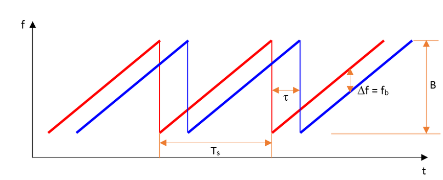

# The Radar Sensor

## Radar vs Lidar

## Signal Properties

In this concept, you will see a general overview of signal properties, including definitions of the wavelength of a signal and the general form for the equation of a signal.

## Single Wave Parameters

Wavelength (\lambda*λ*) is the physical length from one point of a wave to the same point on the next wave, and it is calculated as

\lambda = \frac{\textrm{speed of light}}{\textrm{frequency}}*λ*=frequencyspeed of light

The higher the frequency the smaller the wavelength.

Wavelength of a signal

[source: [techplayon](http://www.techplayon.com/wavelength-frequency-amplitude-phase-defining-waves//)]

The *frequency* of a wave is the number of waves that pass by each second, and is measured in Hertz (Hz). The automotive radar generally operates at W band (76GHz - 81GHz). The signal at this frequency is referred to as millimeterWave since the wavelength is in mm.

The *Bandwidth* of a signal is the difference between the highest and the lowest frequency components in a continous band of frequencies.

The *Amplitude* is the strength of the signal. Often it corresponds to the power of the RF signal/electromagnetic field defined in dB/dBm. It is relevant while configuring the output power of the radar and sensing the received signal. Higher the amplitude of the Radar signal, more is the visibility of radar. Automotive Radar can operate at max of 55 dBm output power (316 W)

dB, dBm, mW, and W conversions can be found [here](https://www.rapidtables.com/electric/dBm.html).

Frequency of a signal [[source](http://www.techplayon.com/wavelength-frequency-amplitude-phase-defining-waves/)]

Amplitude of a signal [[source](http://www.techplayon.com/wavelength-frequency-amplitude-phase-defining-waves/)]

## Phase of a Signal

*Phase* is a particular point in time on the cycle of a waveform, measured as an angle in degrees. A complete cycle is 360°. The phase for each argument value, relative to the start of the cycle, is shown in the image below, in degrees from 0° to 360° and in radians from 0 to 2π.

The frequency can also be defined as the first derivative of the phase with respect to the time.frequency = \frac{d\varphi}{dt}*f**r**e**q**u**e**n**c**y*=*d**t**d**φ*where\varphi = phase\,\,of\,\,the\,\,signal*φ*=*p**h**a**s**e***o***f***t***h**e***s***i**g**n**a**l*

This property will be used in measuring the doppler frequency shift for a moving target.

Phase of sinusoidal waveform

source : Wikipedia

The difference between the phases of two periodic signals is called the *phase* *difference*. At values of when the difference is zero, the two signals are said to be in phase, otherwise they are out of phase with each other.

The phase information processing is important as we go through doppler processing as well as Angle of Arrival techniques for radar.

Phase of a signal

## General Equation of a Wave

A wave travelling in space is defined by the following equation:y(t) = A\cos(2\pi\cdot f_c \cdot t + \phi)*y*(*t*)=*A*cos(2*π*⋅*f**c*⋅*t*+*ϕ*)Below, the variables in the equation are defined:

- A*A* is the amplitude of the signal
- f_c*f**c* is the signal frequency
- \phi*ϕ* is the phase of the signal

## FMCW Chirps

FMCW radar (Frequency-Modulated Continuous Wave radar) is a special type of radar sensor which radiates continuous transmission power. FMCW radar’s ability to measure very small ranges to the target as well as its ability to measure simultaneously the target range and its relative velocity makes it the first choice type of radar for automotive applications.

FMCW waveform

source : emagtech

A *Frequency Modulated Continous Wave* (FMCW) is a signal in which the frequency increases/decreases with time. They are also referred to as upramps and downramps. The two most common waveform pattern used for FMCW radars are sawtooth and triangular. The sawtooth waveform generally uses just the upramps, whereas the triangular waveform uses both upramps and downramps.

Each chirp is defined by its slope. The slope is given by its chirp frequency bandwidth B*B* or B_{sweep}*B**s**w**e**e**p* (y-axis) and its chirp time T_s*T**s* (x-axis). Hence,Slope = \frac{B} {T_s}*S**l**o**p**e*=*T**s**B*

The range resolution requirement decides the B*B*, whereas the maximum velocity capability of a radar is determined by the chirp time T_s*T**s*. We will discuss this in more detail in later sections.

One *chirp sequence* or *segment* comprises of multiple chirps. Each chirp is sampled multiple times to give multiple range measurements and radar transmits in order to measure doppler velocity accurately.

In the course project you will sample each chirp 1024 times and send 128 of these chirps to estimate the range and doppler velocity. So, the segment in this case would comprise of 128 chirps.

## Additional Resources

Additional information can be found on radartutorial.eu [here](http://www.radartutorial.eu/02.basics/Frequency Modulated Continuous Wave Radar.en.html).

## FMCW Hardware Overview

Hardware implementation of the FMCW Radar

**Frequency Synthesizer**: The *frequency synthesizer* is the component that generates the frequency to bring the chirp frequency all the way to 77GHz in case of automotive radar.

**Power Amp**: The *power amp* amplifies the signal so the signal can reach long distance. Since the signal attenuates as it radiates, it needs higher power (amplitude) to reach targets at greater distances.

**Antenna**: The *antenna* converts the electrical energy into electromagnetic waves which radiate through the air, hit the target, and get reflected back toward the radar receiver antenna. The Antenna also increases the strength of the signal by focusing the energy in the desired direction. Additionally, the antenna pattern determines the field of view for the radar.

**Mixer**: In FMCW radar, the *mixer* multiplies the return signal with the sweeping signal generated by the frequency synthesizer. The operation works as frequency subtraction to give the frequency delta - also known as frequency shift or Intermediate frequency (IF). IF = Synthesizer Frequency - Return Signal Frequency.

**Processor**: The *processor* is the processing unit where all the Digital Signal processing, Detection, Tracking, Clustering, and other algorithms take place. This unit could be a microcontroller or even an FPGA.

### The Antenna Pattern

Radar illumination on the road scenario

source : sciencedirect.com

The *antenna pattern* is the geometric pattern of the strengths of the relative field emitted by the antenna.

The *beamwidth* of the antenna determines the field of view for the radar sensor. If the requirement for the radar is to just sense the targets in its own lane then the beamwidth needs to be small enough to cover the complete lane up to desired range. If the beamwidth is wider than the lane width, it will sense the targets in the other lanes as well.

Antenna radiation not only comprises of the main beam but the sidelobes as well. Antenna *sidelobes* are critical because they can generate false alarms and pick interference from undesired direction. As seen in the pattern, the sidelobes of the antenna point in different directions and can sense targets that are not in the main beam. To avoid sidelobe detections it is critical to suppress the sidelobe levels to more than 30dB from the peak of the main beam.

### Antenna Types

Patch Array Antenna [[source](https://www.fhr.fraunhofer.de/en/businessunits/traffic/antenna-development-for-the-automotive-sector.html)]

There are many types of antenna (dipole, patch, horn) that can be used at 77GHz, but the most commonly used antenna type in automotive radar is the patch antenna . The low cost, easy fabrication, and low profile of Patch Array Antennas makes them an ideal choice for automotive radar applications.

## Radar Cross Section Overview

The size and ability of a target to reflect radar energy is defined by a single term, \sigma*σ*, known as the radar cross-section, which has units of m^2*m*2. This unit shows that the radar cross section is an area. The target radar cross sectional area depends on:

- The target’s physical geometry and exterior features:
  - Smooth edges or surface would scatter the waves in all directions, hence lower RCS. Whereas, sharp corners will focus the return signal back in the direction of the source leading to higher RCS. (Image below for different target geometries)
- The direction of the illuminating radar,
- The radar transmitter’s frequency,
- The material used in the cars, trucks, bicycles, and even in some cases, the clothing material for pedestrians.

RCS of the target vehicle

source : https://arxiv.org/pdf/1607.02434.pdf

If absolutely all of the incident radar energy on the target were reflected equally in all directions, then the radar cross section would be equal to the target's cross-sectional area as seen by the transmitter. In practice, some energy is absorbed and the reflected energy is not distributed equally in all directions. Therefore, the radar cross-section is quite difficult to estimate and is normally determined by measurement.

Returns from Different Target Geometries

source : [http://www.radartutorial.eu](http://www.radartutorial.eu/)

## RCS Units

This RCS can also be defined using a logarithmic value (dB), since it increases the return signal strength. The formula for converting from RCS to dB is given by:

RCS_{dB} = 10\log (RCS_{m^2})*R**C**S**d**B*=10log(*R**C**S**m*2)

The following table shows RCS values for different targets in both m^2*m*2 and dB. You can use the formula above to see how the two columns of the table are related. For example, from the table below we can see that for an automobile:

RCS_{dB} = 10 \log (100) = 20*R**C**S**d**B*=10log(100)=20

RCS of different targets

source : [http://www.radartutorial.eu](http://www.radartutorial.eu/)