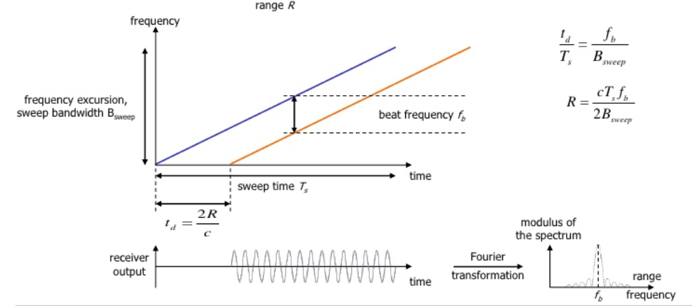
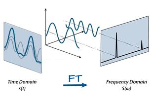

# Range-Doppler Estimation

## Range, Velocity, and Angle Resolution

In this lesson, you will learn about the basics of range and velocity estimation using doppler and Fourier transform techniques. Before you get started, let's have a look at three primary dimensions of measurement for radar resolution.


The capability of a radar to resolve targets is very critical for an accurate perception.

**Range Resolution**: It is the capability of the radar to distinguish between two targets that are very close to each other in range. If a radar has range resolution of 4 meters then it cannot separate on range basis a pedestrian standing 1 m away from the car.

The range resolution is solely dependent on the bandwidth of the chirp B_{sweep}*B**s**w**e**e**p*:

d_{res} = \frac{c}{2B_{sweep}}*d**r**e**s*=2*B**s**w**e**e**p**c*

**Velocity Resolution**: If two targets have the same range they can still be resolved if they are traveling at different velocities. The velocity resolution is dependent on the number of chirps. As discussed for our case we selected to send 128 chirps. A higher number of chirps increases the velocity resolution, but it also takes longer to process the signal.

**Angle Resolution**: Radar is capable of separating two targets spatially. If two targets are at similar range travelling at same velocities, then they can still be resolved based on their angle in radar coordinate system. Angle resolution depends on different parameters depending on the angle estimation technique used. We will cover this in more detail in the next lesson.

## Range Estimation Overview


Signal trip time for a radar signal.


Radar determines the range of the target by measuring the trip time of the electromagnetic signal it radiates. It is known that EM wave travels at a known speed (300,000,000 m/s), so to determine the range the radar needs to calculate the trip time. How?

Answer : By measuring the shift in the frequency.


## Range Estimation Equation




Range Estimation using FMCW

source : Delft University of Technology


The FMCW waveform has the characteristic that the frequency varies linearly with time. If radar can determine the delta between the received frequency and hardware’s continuously ramping frequency then it can calculate the trip time and hence the range. We further divide Range estimate by 2, since the frequency delta corresponds to two way trip.

It is important to understand that if a target is stationary then a transmitted frequency and received frequency are the same. But, the ramping frequency within the hardware is continuously changing with time. So, when we take the delta (beat frequency) between the received and ramping frequency we get the trip time.R = \frac{cT_sf_b}{2B_{sweep}}*R*=2*B**s**w**e**e**p**c**T**s**f**b*

Here, f_b*f**b* is the beat frequency, which is measured by the radar by subtracting the received frequency from the hardware’s ramping frequency:
f_b = f_ {ramping} - f_{received}*f**b*​=*f**r**a**m**p**i**n**g*​−*f**r**e**c**e**i**v**e**d*​

As seen in the equation, the range calculation requires chirp time T_s*T**s* and chirp Bandwidth B_{sweep}*B**s**w**e**e**p*. Those values are determined as we define the configuration of the radar based on its range resolution and trip time for Radar’s maximum range.


## System Level Range Calculation


Range Calculation - System Level

source : electronicdesign.com


As seen in the image above, the Synthesizer generates FMCW chirp for a given B_{sweep}*B**s**w**e**e**p* and T_s*T**s*. Let’s say the signal gets transmitted at 77GHz and it returns to the radar after hitting the target in a certain time duration. The radar receiver captures the signal, processes (subtraction) and measures the frequency delta between received signal and linearly ramping signal. This delta in frequency is called as beat frequency and it is proportional to the trip time. So based on the equation above, the radar calculates the range.


## Range Estimation Exercise

Using the following MATLAB code sample, complete the TODOs to calculate the range in meters of four targets with respective measured beat frequencies [0 MHz, 1.1 MHz, 13 MHz, 24 MHz].

You can use the following parameter values:

- The radar maximum range = 300m
- The range resolution = 1m
- The speed of light c = 3*10^8

Note : The sweep time can be computed based on the time needed for the signal to travel the maximum range. In general, for an FMCW radar system, the sweep time should be at least 5 to 6 times the round trip time. This example uses a factor of 5.5:

T_{chirp} =5.5\cdot 2 \cdot R_{max}/c*T**c**h**i**r**p*=5.5⋅2⋅*R**m**a**x*/*c*

Print your answer using the `disp` function.

```matlab
% Range Estimation Exercise
% TODO : Find the Bsweep of chirp for 1 m resolution
deltaR = 1;
c = 3*10^8;
bSweep = c/2*deltaR;

% TODO : Calculate the chirp time based on the Radar's Max Range
rangeMax = 300;
Ts = 5.5*2*rangeMax/c;

% TODO : define the frequency shifts 
frequencyShift = [0, 1.1e6, 13e6, 24e6];
calculated_range = c * Ts * frequencyShift / (2 * bSweep);

% Display the calculated range
disp(calculated_range);% TODO : Find the Bsweep of chirp for 1 m resolution
```

Output:

```
0   12.1000  143.0000  264.0000
```


## FMCW Doppler Measurements


FMCW Doppler Estimation

source : Delft University of Technology


As discussed above, there will be a shift in the received signal frequency due to the doppler effect of the target’s velocity. The doppler shift is directly proportional to the velocity of the target as shown below.f_D = \frac{2\nu_r}{\lambda}*f**D*=*λ*2*ν**r*

- f_D*f**D*: shift in the transmitted frequency due to the doppler
- \nu_r*ν**r* : relative velocity of the target
- \lambda*λ* : wavelength of the signal

By measuring the shift in the frequency due to doppler, radar can determine the velocity. The receding target will have a negative velocity due to the frequency dropping lower, whereas the approaching target will have positive velocity as the frequency shifts higher.

The beat frequency comprises of both frequency components: f_r*f**r* (frequency delta due to range) and f_d*f**d* (frequency shift due to velocity). Although, in the case of automotive radar the f_d*f**d* is very small in comparison to the f_r*f**r*. Hence, the doppler velocity is calculated by measuring the rate of change of phase across multiple chirps.

The following equation shows the relationship between the rate of change of the phase \PhiΦ, and the frequency:

\frac{d\Phi}{dt} = frequency*d**t**d*Φ=*f**r**e**q**u**e**n**c**y*


## DOPPLER PHASE SHIFT

Keeping that in consideration, we calculate the doppler frequency by measuring the rate of change of phase. The phase change occurs due to small displacement of a moving target for every chirp duration. Since, each chirp duration is generally in microseconds, it results in small displacement in mm (millimeters). These small displacements for every chirp leads to change in phase. Using this rate of change of phase we can determine the doppler frequency.

Let's see how :

If the path between a target and the radar is changed by an amount Δx, the phase of the wave received by radar is shifted by\Delta \varphi = \frac{\Delta x}{\lambda} \qquad (\lambda = 2\pi \,\, or \,\, 360 \degree)Δ*φ*=*λ*Δ*x*(*λ*=2*π***o***r*360°)\Delta \varphi = f*\frac{\Delta x}{c} \qquad (\lambda = f/c)Δ*φ*=*f*∗*c*Δ*x*(*λ*=*f*/*c*)where λ and f are, respectively, the wavelength and frequency of the signal and c is the speed of propagation. The resulting change in observed frequency is\Delta f = \frac{\Delta\varphi}{\Delta t}Δ*f*=Δ*t*Δ*φ*
where Δt is the time taken for the observation of the phase change.


## Doppler Estimation Exercises

Using the following MATLAB code sample, complete the TODOs to calculate thevelocity in m/s of four targets with following doppler frequency shifts: [3 KHz, -4.5 KHz, 11 KHz, -3 KHz].

You can use the following parameter values:

- The radar's operating frequency = 77 GHz
- The speed of light c = 3*10^8

```matlab
% Doppler Velocity Calculation
c = 3*10^8;         %speed of light
frequency = 77e9;   %frequency in Hz

% TODO : Calculate the wavelength
lambda = c / frequency;

% TODO : Define the doppler shifts in Hz using the information from above 
doppler_shift = [3e3, -4.5e3, 11e3, -3e3]

% TODO : Calculate the velocity of the targets  fd = 2*vr/lambda
velocity = doppler_shift * lambda / 2;

% TODO: Display results
disp(velocity);
```

### Doppler Estimation Further Research

For additional resources related to doppler estimation, see these [lecture notes](http://www.phys.uconn.edu/~gibson/Notes/Section6_3/Sec6_3.htm).


## Fast Fourier Transform (FFT)

ADC (Analog Digital Converter) converts the analog signal into digital. But, post ADC the Fast Fourier Transform is used to convert the signal from time domain to frequency domain. Conversion to frequency domain is important to do the spectral analysis of the signal and determine the shifts in frequency due to range and doppler.




Time Domain to Frequency Domain Conversion using FFT.

source : mriquestions.com


The traveling signal is in time domain. Time domain signal comprises of multiple frequency components as shown in the image above. In order to separate out all frequency components the FFT technique is used.

For the purpose of this course we don’t have to get into mathematical details of FFT. But, it is important to understand the use of FFT in radar’s digital signal processing. It gives the frequency response of the return signal with each peak in frequency spectrum representing the detected target’s chararcterstics.

Learn more on FFT implementation [here](https://www.youtube.com/watch?v=t_NMmqTRPIY&feature=youtu.be).


Fast Fourier Transform

source : Texas Instruments


As seen in the image below, the Range FFTs are run for every sample on each chirp. Since each chirp is sampled N times, it will generate a range FFT block of N * (Number of chirps). These FFT blocks are also called FFT bins.


Range FFT

source : Delft University of Technology


Each chirp is sampled N times, and for each sample it produces a range bin. The process is repeated for every single chirp. Hence creating a FFT block of N*(Number of chirps).

Each bin in every column of block represents increasing range value, so that the end of last bin represents the maximum range of a radar.


Output of Range FFT in MATLAB. X-axis = Beat Frequency, Y-axis = Signal power in dBm


Above is the output of the 1st stage FFT (i.e Range FFT). The three peaks in the frequency domain corresponds to the beat frequencies of three different cars located at 150, 240 and 300 m range from the ego vehicle.


## Fast Fourier Transform Exercise


In the following exercise, you will use a Fourier transform to find the frequency components of a signal buried in noise. Specify the parameters of a signal with a sampling frequency of 1 kHz and a signal duration of 1.5 seconds.

To implement the 1st stage FFT, you can use the following steps:

1. Define a signal. In this case (amplitude = A, frequency = f)

   ```
   signal = A*cos(2*pi*f*t)
   ```

2. Run the fft for the signal using MATLAB fft function for dimension of samples N.

   ```
   signal_fft = fft(signal,N);
   ```

3. The output of FFT processing of a signal is a complex number (a+jb). Since, we just care about the magnitude we take the absolute value (sqrt(a^2+b^2)) of the complex number.

   ```
   signal_fft = abs(signal_fft);
   ```

4. FFT output generates a mirror image of the signal. But we are only interested in the positive half of signal length L, since it is the replica of negative half and has all the information we need.

   ```
   signal_fft  = signal_fft(1:L/2-1)       
   ```

5. Plot this output against frequency.

### Solution:

```matlab
Fs = 1000;            % Sampling frequency                    
T = 1/Fs;             % Sampling period       
L = 1500;             % Length of signal
t = (0:L-1)*T;        % Time vector

% TODO: Form a signal containing a 77 Hz sinusoid of amplitude 0.7 and a 43Hz sinusoid of amplitude 2.
S = 0.7*sin(2*pi*77*t) + 2*sin(2*pi*43*t);

% Corrupt the signal with noise 
X = S + 2*randn(size(t));

% Plot the noisy signal in the time domain. It is difficult to identify the frequency components by looking at the signal X(t). 
plot(1000*t(1:50) ,X(1:50))
title('Signal Corrupted with Zero-Mean Random Noise')
xlabel('t (milliseconds)')
ylabel('X(t)')

% TODO : Compute the Fourier transform of the signal. 
Y = fft(X);
% TODO : Compute the two-sided spectrum P2. Then compute the single-sided spectrum P1 based on P2 and the even-valued signal length L.
P2 = abs(Y/L);
P1  = P2(1:L/2+1);

% Plotting
f = Fs*(0:(L/2))/L;
plot(f,P1) 
title('Single-Sided Amplitude Spectrum of X(t)')
xlabel('f (Hz)')
ylabel('|P1(f)|')
```


### Doppler Estimation Further Research

For additional resources related to FFT, see these [lecture notes](https://classroom.udacity.com/nanodegrees/nd313/parts/0701cbc4-73a7-4e19-895a-0bd0695f0365/modules/b52e21b1-f7ef-434a-9378-58b75dfa6800/lessons/f48cb6e7-1bf7-4ffb-81fa-48ad13531ff8/concepts/www.phys.nsu.ru/cherk/fft.pdf).

## The 2D FFT

Once the range bins are determined by running range FFT across all the chirps, a second FFT is implemented along the second dimension to determine the doppler frequency shift. As discussed, the doppler is estimated by processing the rate of change of phase across multiple chirps. Hence, the doppler FFT is implemented after all the chirps in the segment are sent and range FFTs are run on them.

The output of the first FFT gives the beat frequency, amplitude, and phase for each target. This phase varies as we move from one chirp to another (one bin to another on each row) due to the target’s small displacements. Once the second FFT is implemented it determines the rate of change of phase, which is nothing but the doppler frequency shift.


After running 2nd FFT across the rows of FFT block we get the doppler FFT. The complete implementation is called 2D FFT.

After 2D FFT each bin in every column of block represents increasing range value and each bin in the row corresponds to a velocity value.


The output of Range Doppler response represents an image with Range on one axis and Doppler on the other. This image is called as Range Doppler Map (RDM). These maps are often used as user interface to understand the perception of the targets.


2D FFT output for single target. The x-axis here is the velocity and the y-axis is the range.


Range Doppler Map

source : rohde-schwarz


## 2D FFT Exercise

The following steps can be used to compute a 2D FFT in MATLAB:

1. Take a 2D signal matrix

2. In the case of Radar signal processing. Convert the signal in MxN matrix, where M is the size of Range FFT samples and N is the size of Doppler FFT samples:

   ```matlab
   signal  = reshape(signal, [M, N]);
   ```

3. Run the 2D FFT across both the dimensions.

   ```matlab
   signal_fft = fft2(signal, M, N);
   ```

   Note the following from the [documentation](https://www.mathworks.com/help/matlab/ref/fft2.html):

   > `Y = fft2(X)` returns the 2D FFT of a matrix using a fast Fourier transform algorithm, which is equivalent to computing `fft(fft(X).').'`. If `X` is a multidimensional array, then fft2 takes the 2-D transform of each dimension higher than 2. The output `Y` is the same size as `X`. `Y = fft2(X,M,N)` truncates `X` or pads `X` with trailing zeros to form an m-by-n matrix before computing the transform. `Y` is m-by-n. If `X` is a multidimensional array, then fft2 shapes the first two dimensions of `X` according to m and n.

4. Shift zero-frequency terms to the center of the array

   ```matlab
   signal_fft = fftshift(signal_fft);
   ```

5. Take the absolute value

   ```matlab
   signal_fft = abs(signal_fft);
   ```

6. Here since it is a 2D output, it can be plotted as an image. Hence, we use the

   ```matlab
   imagesc(signal_fft);
   ```

## 2D FFT Exercise

In the following exercise, you will practice the 2D FFT in MATLAB using some generated data. The data generated below will have the correct shape already, so you should just need to use steps 3-6 from above. You can use the following starter code:

```matlab
% 2-D Transform
% The 2-D Fourier transform is useful for processing 2-D signals and other 2-D data such as images.
% Create and plot 2-D data with repeated blocks.

P = peaks(20);
X = repmat(P,[5 10]);
imagesc(X)

% TODO : Compute the 2-D Fourier transform of the data.  
% Shift the zero-frequency component to the center of the output, and 
% plot the resulting 100-by-200 matrix, which is the same size as X.

Y = fft2(X);
imagesc(abs(fftshift(Y)));
```