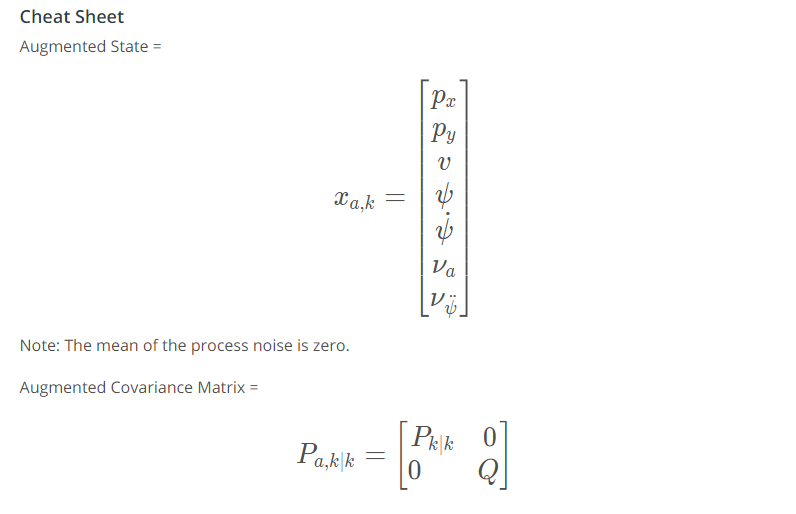
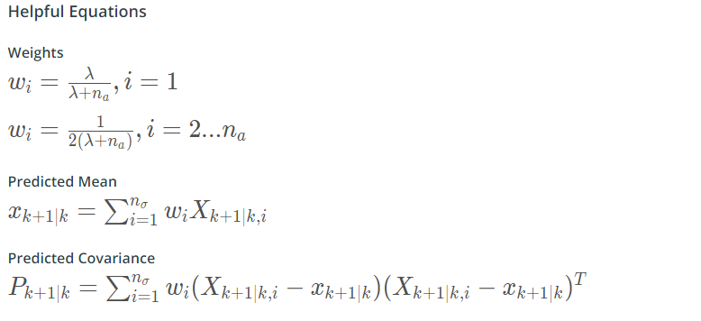

# Unscented Kalman Filters

## The CTRV Model State Vector (Constant Turn Rate and Velocity)


### Generating Sigma Points Assignment 1

#### Helpful Equations and Resources


and you can set columns easily in a matrix using the `.col()` function.

- [Eigen Quick Reference Guide](https://eigen.tuxfamily.org/dox/group__QuickRefPage.html)
- [Eigen Documentation of Cholesky Decomposition](https://eigen.tuxfamily.org/dox/classEigen_1_1LLT.html)

Please note that the algorithm used in the quiz `(P.llt().matrixL())`produces the lower triangular matrix `L` of the matrix `P` such that `P = L*L^`.

```c++
// create sigma point matrix
MatrixXd Xsig = MatrixXd(n_x, 2 * n_x + 1);

// calculate square root of P
MatrixXd A = P.llt().matrixL();

// your code goes here 
// calculate sigma points ...
// set sigma points as columns of matrix Xsig
Xsig.col(0) = x;
for (int i=0; i<n_x; i++)
{
    Xsig.col(i+1)     = x + sqrt(lambda+n_x) * A.col(i);
    Xsig.col(i+1+n_x) = x - sqrt(lambda+n_x) * A.col(i);
}
```

## UKF Augmentation


UKF augmentation is to represent the uncertainty of the process noise covariance matrix Q, with sigma points.

### Augmentation Assignment 1



```c++
// create augmented mean state
x_aug.head(n_x) = x;
x_aug(n_x) = 0;
x_aug(n_x+1) = 0;

// create augmented covariance matrix
P_aug.fill(0.0);
P_aug.topLeftCorner(n_x,n_x) = P;
P_aug(n_x,n_x) = std_a*std_a;
P_aug(n_x+1,n_x+1) = std_yawdd*std_yawdd;

// create square root matrix
MatrixXd A = P_aug.llt().matrixL();

// create augmented sigma points
Xsig_aug.col(0) = x_aug;
for (int i=0; i<n_aug; i++)
{
    Xsig_aug.col(i+1)       = x_aug + sqrt(lambda+n_aug) * A.col(i);
    Xsig_aug.col(i+1+n_aug) = x_aug - sqrt(lambda+n_aug) * A.col(i);
}
```


## Sigma Point Prediction


### Sigma Point Prediction Assignment 1


```c++
// predict sigma points
for (int i = 0; i < 2*n_aug+1; i++)
{
    // extract values for better readability
    double p_x = Xsig_aug(0,i);
    double p_y = Xsig_aug(1,i);
    double v = Xsig_aug(2,i);
    double yaw = Xsig_aug(3,i);
    double yawd = Xsig_aug(4,i);
    double nu_a = Xsig_aug(5,i);
    double nu_yawdd = Xsig_aug(6,i);

    // predicted state values
    double px_p, py_p, v_p, yaw_p, yawd_p;

    // avoid division by zero
    if (fabs(yawd) > 0.001) {
        px_p = p_x + v/yawd * (sin(yaw + yawd*delta_t) - sin(yaw));
        py_p = p_y + v/yawd * (cos(yaw) - cos(yaw + yawd*delta_t));
    } else {
        px_p = p_x + v*delta_t*cos(yaw);
        py_p = p_y + v*delta_t*sin(yaw);
    }

    v_p = v;
    yaw_p = yaw + yawd*delta_t;
    yawd_p = yawd;

    // add noise
    px_p += 0.5*delta_t*delta_t*cos(yaw)*nu_a;
    py_p += 0.5*delta_t*delta_t*sin(yaw)*nu_a;
    v_p += delta_t*nu_a;
    yaw_p += 0.5*delta_t*delta_t*nu_yawdd;
    yawd_p += delta_t*nu_yawdd;

    // write predicted sigma point into column
    Xsig_pred(0,i) = px_p;
    Xsig_pred(1,i) = py_p;
    Xsig_pred(2,i) = v_p;
    Xsig_pred(3,i) = yaw_p;
    Xsig_pred(4,i) = yawd_p;
}
```

## Predict Mean and Covariance


### Predicted Mean and Covariance Assignment 1



```c++
// set weights
weights.fill(0.5/(lambda+n_aug));
weights(0) = lambda/(lambda+n_aug);

// predict state mean
x.fill(0.0);
for (int i = 0; i < 2*n_aug+1; i++)
{
    x = x + weights(i)*Xsig_pred.col(i);
}

// predict state covariance matrix
P.fill(0.0);
for (int i = 0; i < 2*n_aug+1; i++)
{
    // state difference
    VectorXd x_diff = Xsig_pred.col(i) - x;
    // angle normalization
    while (x_diff(3)> M_PI) x_diff(3)-=2.*M_PI;
    while (x_diff(3)<-M_PI) x_diff(3)+=2.*M_PI;

    P = P + weights(i) * x_diff * x_diff.transpose();
}
```

## Predict Radar Measurement Assignment (Update Cycle)


```c++
// transform sigma points into measurement space
for (int i = 0; i < 2*n_aug+1; i++)
{
    // extract values for better readability
    double p_x = Xsig_pred(0,i);
    double p_y = Xsig_pred(1,i);
    double v = Xsig_pred(2,i);
    double yaw = Xsig_pred(3,i);
    double yawd = Xsig_pred(4,i);

    Zsig(0,i) = sqrt(p_x*p_x + p_y*p_y);
    Zsig(1,i) = atan2(p_y,p_x);
    Zsig(2,i) = (p_x*cos(yaw)*v + p_y*sin(yaw)*v)/Zsig(0,i);
}

// calculate mean predicted measurement
z_pred.fill(0.0);
for (int i = 0; i < 2*n_aug+1; i++)
{
    z_pred += weights(i) * Zsig.col(i);
}

// calculate innovation covariance matrix S
S.fill(0.0);
for (int i = 0; i < 2*n_aug+1; i++)
{
    // state difference
    VectorXd z_diff = Zsig.col(i) - z_pred;
    // angle normalization
    while (z_diff(1)> M_PI) z_diff(1)-=2.*M_PI;
    while (z_diff(1)<-M_PI) z_diff(1)+=2.*M_PI;

    S += weights(i) * z_diff * z_diff.transpose();
}

// add measurement noise covariance matrix
MatrixXd R = MatrixXd(n_z,n_z);
R <<  std_radr*std_radr, 0, 0,
0, std_radphi*std_radphi, 0,
0, 0,std_radrd*std_radrd;
S = S + R;
```


## UKF Update


### UKF Update Assignment 1


```c++
// calculate cross correlation matrix
Tc.fill(0.0);
for (int i = 0; i < 2 * n_aug + 1; ++i) {  // 2n+1 simga points
    // residual
    VectorXd z_diff = Zsig.col(i) - z_pred;
    // angle normalization
    while (z_diff(1)> M_PI) z_diff(1)-=2.*M_PI;
    while (z_diff(1)<-M_PI) z_diff(1)+=2.*M_PI;

    // state difference
    VectorXd x_diff = Xsig_pred.col(i) - x;
    // angle normalization
    while (x_diff(3)> M_PI) x_diff(3)-=2.*M_PI;
    while (x_diff(3)<-M_PI) x_diff(3)+=2.*M_PI;

    Tc += weights(i) * x_diff * z_diff.transpose();
}

// calculate Kalman gain K;
MatrixXd K = Tc * S.inverse();

// update state mean and covariance matrix
x = x + K * (z - z_pred);
P = P - K * S * K.transpose();
```


### Parameters and Consistency


### Process Noise and the UKF Project

For the CTRV model, two parameters define the process noise:

- \large \sigma^2_a*σ**a*2 representing longitudinal acceleration noise (you might see this referred to as linear acceleration)
- \large \sigma^2_{\ddot\psi}*σ**ψ*¨2 representing yaw acceleration noise (this is also called angular acceleration)

In the project, both of these values will need to be tuned. You will have to test different values in order to get a working solution. In the video, Dominik mentions using \large \sigma^2_a = 9 \frac{m^2}{s^4}*σ**a*2=9*s*4*m*2 as a starting point when tracking a vehicle. In the UKF project, you will be tracking a bicycle rather than a vehicle. So 9 might not be an appropriate acceleration noise parameter. Tuning will involve:

- guessing appropriate parameter values
- running the UKF filter
- deciding if the results are good enough
- tweaking the parameters and repeating the process


### Linear Acceleration Noise Parameter Intuition

Let's get some intuition for these noise parameters. The units for the acceleration noise parameter \large \sigma^2_a*σ**a*2 are \Large\frac{m^2}{s^4}*s*4*m*2. Taking the square root, we get \large \sigma_a*σ**a* with units \large \frac{m}{s^2}*s*2*m*. So the square root of the acceleration noise parameter has the same units as acceleration: \large \frac{m}{s^2}*s*2*m*

The parameter \large \sigma_a*σ**a* is the standard deviation of linear acceleration! Remember from the "CTRV Process Noise Vector" lecture that the linear acceleration is being modeled as a Gaussian distribution with mean zero and standard deviation \large \sigma_a*σ**a*. In a Gaussian distribution, about 95% of your values are within 2\large \sigma_a*σ**a*.

So if you choose \large \sigma^2_a = 9 \frac{m^2}{s^4}*σ**a*2=9*s*4*m*2, then you expect the acceleration to be between \large -6 \frac{m}{s^2}−6*s*2*m* and \large +6 \frac{m}{s^2}+6*s*2*m* about 95% of the time.

Tuning parameters involves some trial and error. Using your intuition can help you find reasonable initial values.

### Measurement Noise Parameters

Measurement noise parameters represent uncertainty in sensor measurements. In general, the manufacturer will provide these values in the sensor manual. In the UKF project, you will not need to tune these parameters.