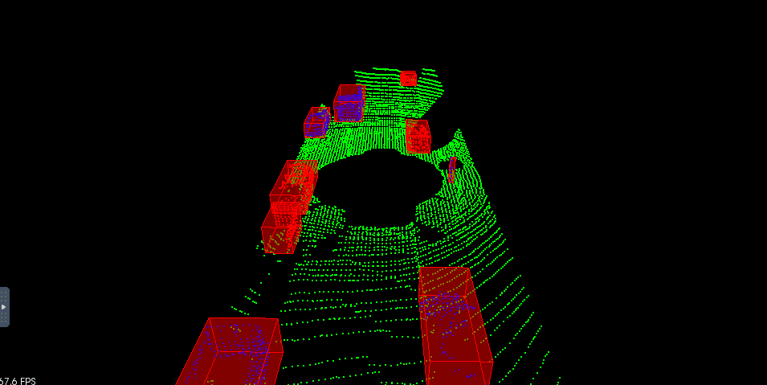

# Sensor Fusion Nanodegree

## Lessons

1. [Lidar](1.lidar)
   1. Point Cloud Segmentation - [segment](1.lidar/segment.md)
   2. Clustering Obstacles - [cluster](1.lidar/cluster.md)
   3. Working with Real PCD - [filter](1.lidar/filter.md)
2. [Camera](2.camera)
3. [Radar](3.radar)

## Projects

### Project 1 - Lidar Obstacle Detection

