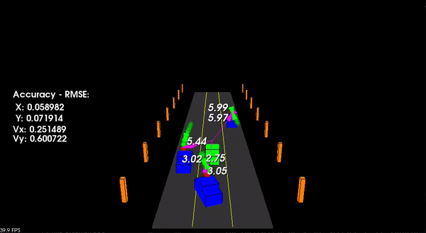

# Sensor Fusion Nanodegree

## Lessons

1. [Lidar](1.lidar)
   1. Point Cloud Segmentation - [segment](1.lidar/segment.md)
   2. Clustering Obstacles - [cluster](1.lidar/cluster.md)
   3. Working with Real PCD - [filter](1.lidar/filter.md)
2. [Camera](2.camera)
   1. Camera - [camera](2.camera/camera.md)
   2. Collision - [collision](2.camera/collision.md)
   3. Tracking Features - [tracking-features](2.camera/tracking-features.md)
   4. Lidar-Camera Projection - [lidar-camera-projection](2.camera/lidar-camera-projection.md)
3. [Radar](3.radar)
   1. Radar Principles - [radar-principles](3.radar/radar-principles.md)
   2. Range-Doppler Estimation- [range-doppler-estimation](3.radar/range-doppler-estimation.md)
   3. Clutter, CFAR, AoA - [clutter-cfar-aoa](3.radar/clutter-cfar-aoa.md)
   4. Clustering and Tracking - [radar-clustering-tracking](3.radar/radar-clustering-tracking.md)
4. [Kalman Filters](4.kalman_filters)
   1. Unscented Kalman Filters - [ukf](4.kalman_filters/ukf.md)

## Projects

### Project 1 - Lidar Obstacle Detection

### Project 5 - Unscented Kalman Filters

