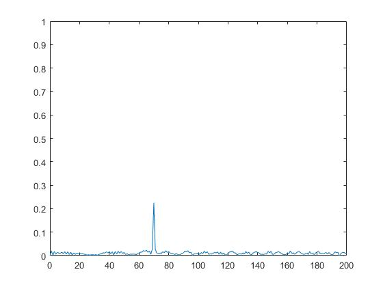
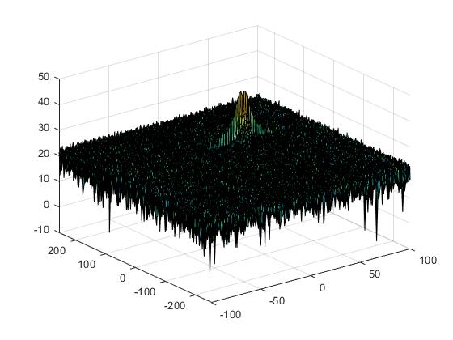
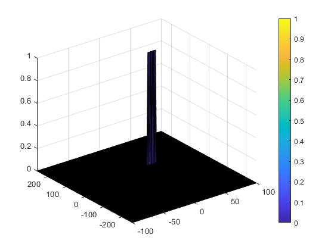

# Radar Target Generation and Detection

## Project Goal

- Configure the FMCW waveform based on the system requirements.
- Define the range and velocity of target and simulate its displacement.
- For the same simulation loop process the transmit and receive signal to determine the beat signal
- Perform Range FFT on the received signal to determine the Range
- Towards the end, perform the CFAR processing on the output of 2nd FFT to display the target.

## Radar System Requirements

- Implementation steps for the 2D CFAR process.
- Selection of Training, Guard cells and offset.
- Steps taken to suppress the non-thresholded cells at the edges.

## Implementation Steps

After determining the beat signal and FFT, range FFT output is:

The 2D FTT is run on the mixed signal (beat signal) output to generate the Range Doppler Map.

### 2D CFAR process

- The number of Training Cells in both the dimensions are selected

  **Tr = 12**

  **Td = 6**

- The number of Guard Cells in both dimensions around the Cell under test (CUT) for accurate estimation are selected

  **Gr = 6**

  **Gd = 3**

- The offset the threshold by SNR value in dB

  **Offset = 10**

- Slide the cell under test across the complete matrix. Make sure the CUT has margin for Training and Guard cells from the edges.

- For every iteration sum the signal level within all the training cells. To sum convert the value from logarithmic to linear using db2pow function.

- Average the summed values for all of the training cells used. After averaging convert it back to logarithmic using pow2db.

- Further add the offset to it to determine the threshold.

- Next, compare the signal under CUT against this threshold.

- If the CUT level > threshold assign it a value of 1, else equate it to 0.

- To keep the map size same as it was before CFAR, equate all the non-thresholded cells at the edges to 0.

### CFAR Result

The object is successfully detected without any false positive.

